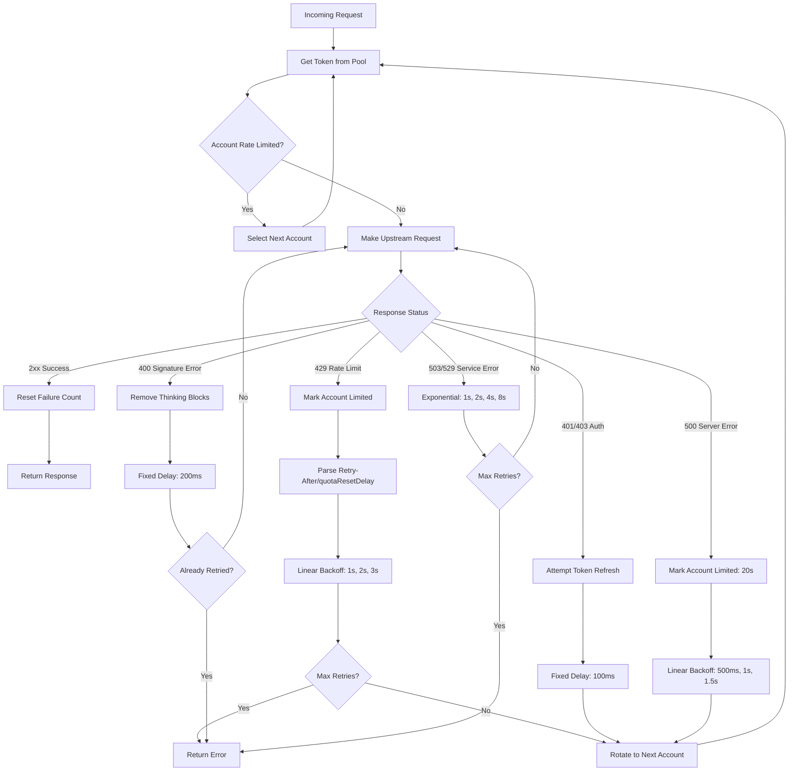

# Error Recovery & Retry Mechanism

## Overview

Antigravity Manager implements intelligent error recovery with automatic retry, account rotation, and progressive backoff strategies. The system handles various error scenarios including rate limits (429), authentication failures (401), server errors (5xx), and temporary service unavailability.

The error recovery mechanism operates at three layers:
1. **HTTP Layer**: Network-level retries with exponential backoff
2. **Account Layer**: Multi-account rotation with intelligent selection
3. **Protocol Layer**: Request transformation and error mapping

## Architecture

### Core Components

#### 1. Token Manager (`src-tauri/src/proxy/token_manager.rs`)
- **Responsibility**: Account selection, rotation, and lifecycle management
- **Key Features**:
  - Multi-account token pool management
  - Model-aware rate limiting (per-model quota tracking)
  - Intelligent account selection based on subscription tier and quota
  - Sticky session support for conversation continuity

#### 2. Rate Limit Tracker (`src-tauri/src/proxy/rate_limit.rs`)
- **Responsibility**: Rate limit detection and account lockout management
- **Key Features**:
  - Multi-tier rate limit detection (quota, rate, capacity, server errors)
  - Intelligent lockout duration calculation
  - Real-time quota refresh integration
  - Model-specific rate limiting

#### 3. Upstream Client (`src-tauri/src/proxy/upstream/client.rs`)
- **Responsibility**: HTTP communication with upstream APIs
- **Key Features**:
  - Multi-endpoint failover (prod → daily)
  - Connection pooling and keep-alive optimization
  - Request/response logging for debugging

#### 4. Protocol Handlers (`src-tauri/src/proxy/handlers/claude.rs`)
- **Responsibility**: Request orchestration and retry coordination
- **Key Features**:
  - Unified retry strategy engine
  - Account rotation decision logic
  - Thinking signature error recovery
  - Auto-stream conversion for quota optimization

### Retry Strategy Matrix

| Error Code | Error Type | Strategy | Backoff | Account Rotation |
|-----------|-----------|----------|---------|------------------|
| 429 | Rate Limit | Linear | 1s, 2s, 3s | ✅ Yes |
| 401/403 | Auth Error | Fixed | 100ms | ✅ Yes |
| 400 | Invalid Signature | Fixed | 200ms | ❌ No (request cleanup) |
| 500 | Server Error | Linear | 500ms, 1s, 1.5s | ✅ Yes |
| 503/529 | Service Unavailable | Exponential | 1s, 2s, 4s, 8s | ❌ No (server-side issue) |
| Other | Non-Retryable | None | N/A | ❌ No |

### Implementation Locations

**Token Manager** (`src-tauri/src/proxy/token_manager.rs`):
- `get_token()` - Account selection with rotation support (lines 191-573)
- `mark_rate_limited_async()` - Async rate limit marking with quota refresh (lines 906-996)
- `mark_account_success()` - Success tracking for smart backoff (line 757)

**Upstream Client** (`src-tauri/src/proxy/upstream/client.rs`):
- `call_v1_internal()` - Multi-endpoint failover logic (lines 89-296)
- `build_url()` - URL construction for different endpoints (lines 66-72)

**Claude Handler** (`src-tauri/src/proxy/handlers/claude.rs`):
- `handle_messages()` - Main retry orchestration loop (lines 375-1119)
- `determine_retry_strategy()` - Error-specific strategy selection (lines 245-296)
- `apply_retry_strategy()` - Backoff execution (lines 299-356)
- `should_rotate_account()` - Account rotation decision (lines 359-368)

**Rate Limit Tracker** (`src-tauri/src/proxy/rate_limit.rs`):
- `parse_from_error()` - Error analysis and lockout calculation (lines 166-327)
- `parse_rate_limit_reason()` - Rate limit type detection (lines 329-377)
- `is_rate_limited_for_model()` - Model-aware rate limit check (lines 547-564)

### Retry Flow



## Rate Limit Handling

### Three-Tier Lockout Strategy

1. **Explicit Retry Time** (Priority 1)
   - Source: API response `Retry-After` header or `quotaResetDelay` field
   - Action: Use exact time + 200ms safety buffer
   - Minimum: 2 seconds (safety buffer)

2. **Real-time Quota Refresh** (Priority 2)
   - Source: Live call to `fetch_quota()` API
   - Action: Extract `reset_time` from fresh quota data
   - Fallback: Continue to Priority 3 if API call fails

3. **Cached Quota Reset Time** (Priority 3)
   - Source: Local account file `quota.models[].reset_time`
   - Action: Parse ISO 8601 timestamp, lock until that time

4. **Intelligent Backoff** (Priority 4 - Fallback)
   - Source: Internal failure counter
   - Action: Progressive lockout based on consecutive failures
     - 1st failure: 60 seconds
     - 2nd failure: 5 minutes
     - 3rd failure: 30 minutes
     - 4th+ failures: 2 hours

### Model-Aware Rate Limiting

The system tracks rate limits per model to avoid cross-model quota interference:

```rust
// Check if account is limited for specific model
token_manager.is_rate_limited_for_model(&account_id, "claude-opus-4-5-thinking")

// Mark account as limited for specific model
token_manager.mark_rate_limited_async(
    &account_id,
    429,
    retry_after_header,
    error_body,
    Some("claude-opus-4-5-thinking")  // Model-specific lockout
).await;
```

**Storage Key Format**:
- Account-level: `{account_id}`
- Model-level: `{account_id}:{model_name}`

## Account Rotation Logic

### Rotation Decision Matrix

| Error Type | Rotate Account? | Reason |
|-----------|----------------|---------|
| 429 Rate Limit | ✅ Yes | Account-specific quota exhaustion |
| 401/403 Auth | ✅ Yes | Account-specific auth failure |
| 500 Server Error | ✅ Yes | May be account-specific |
| 400 Bad Request | ❌ No | Request format issue (not account-specific) |
| 503/529 Service Error | ❌ No | Server-wide capacity issue |

### Account Selection Algorithm

1. **Sort by Subscription Tier** (Priority)
   - ULTRA (0) → PRO (1) → FREE (2) → Unknown (3)
   - Rationale: Higher tiers have faster quota reset

2. **Filter Rate-Limited Accounts**
   - Check both account-level and model-level rate limits
   - Skip accounts with active lockouts

3. **Sticky Session Support** (Optional)
   - Reuse same account for session ID if not rate-limited
   - Automatically unbind if account becomes limited

4. **60-Second Window Lock** (Fallback)
   - For non-session requests, lock last-used account for 60s
   - Prevents rapid account switching

## Event Logging

All retry events emit structured logs with `[Epic-005-Retry]` prefix for easy filtering and monitoring.

### Log Levels

- **INFO**: Successful operations, account rotation, recovery actions
- **WARN**: Rate limits detected, retry attempts, backoff warnings
- **ERROR**: Max retries exhausted, critical failures

### Log Format

```
[Epic-005-Retry] <Operation>: <Details>
```

### Key Log Patterns

**Account Rotation**:
```
[Epic-005-Retry] Account rotation: user1@example.com → user2@example.com (reason: 429)
```

**HTTP Retry with Backoff**:
```
[Epic-005-Retry] HTTP retry attempt 2/3: Rate limit exceeded (backoff: 2000ms)
```

**Retry Success**:
```
[Epic-005-Retry] Retry succeeded on attempt 2: 200 OK
```

**Rate Limit Detection**:
```
[Epic-005-Retry] Rate limit detected: model=claude-opus-4-5-thinking, account=user@example.com
```

**Token Refresh**:
```
[Epic-005-Retry] Token refresh triggered: account=user@example.com
```

**Max Retries Exhausted**:
```
[Epic-005-Retry] Max retries exhausted: 3 attempts failed
```

## Configuration

### Default Retry Limits

```rust
const MAX_RETRY_ATTEMPTS: usize = 3;
```

### Backoff Timing

**Fixed Delays**:
- Auth errors (401/403): 100ms
- Signature errors (400): 200ms

**Linear Backoff**:
- Rate limits (429): base × attempt (1s, 2s, 3s)
- Server errors (500): base × attempt (500ms, 1s, 1.5s)

**Exponential Backoff**:
- Service errors (503/529): base × 2^attempt, max 8s (1s, 2s, 4s, 8s)

### Timeout Settings

```rust
// Connection timeout
.connect_timeout(Duration::from_secs(20))

// Request timeout
.timeout(Duration::from_secs(600))

// Pool settings
.pool_max_idle_per_host(16)
.pool_idle_timeout(Duration::from_secs(90))
```

## Troubleshooting

### Common Issues

#### 1. Infinite Retry Loops

**Symptoms**: Requests never succeed, logs show continuous retries

**Causes**:
- All accounts exhausted
- Max retries set too high
- Rate limit time not properly parsed

**Solutions**:
```bash
# Check rate limit status
RUST_LOG=rate_limit=debug cargo run

# Verify max retries configuration
const MAX_RETRY_ATTEMPTS: usize = 3;

# Monitor retry events
RUST_LOG=retry_event=info cargo run
```

#### 2. Account Pool Exhaustion

**Symptoms**: "No available accounts" errors, all accounts rate-limited

**Causes**:
- Insufficient account pool size
- All accounts hitting quota simultaneously
- Rate limit detection too aggressive

**Solutions**:
```bash
# Add more accounts to pool
# Location: {data_dir}/accounts/*.json

# Check account status
RUST_LOG=token_manager=debug cargo run

# Review rate limit tracker
# Verify lockout times are reasonable
```

#### 3. Token Expiration Errors

**Symptoms**: 401 errors, "OAuth refresh failed (invalid_grant)"

**Causes**:
- Refresh token revoked or expired
- OAuth flow not completed properly
- Account disabled by user

**Solutions**:
```bash
# Re-authorize affected accounts
# The system auto-disables accounts with invalid_grant

# Check disabled accounts
# File: {data_dir}/accounts/{account_id}.json
# Field: "disabled": true, "disabled_reason": "invalid_grant"

# Re-enable after fixing auth
# Remove "disabled" field or set to false
```

## Examples

### Enable Retry Event Logging

```bash
# Filter only retry events
RUST_LOG=retry_event=info cargo run

# Combine with other modules
RUST_LOG=retry_event=info,token_manager=debug cargo run

# Maximum verbosity for debugging
RUST_LOG=trace cargo run
```

### Example Log Output

```
[2026-01-11T10:30:15Z INFO retry_event] [Epic-005-Retry] Rate limit detected: model=claude-opus-4-5-thinking, account=user1@example.com
[2026-01-11T10:30:15Z WARN retry_event] [Epic-005-Retry] HTTP retry attempt 1/3: QUOTA_EXHAUSTED (backoff: 1000ms)
[2026-01-11T10:30:16Z INFO retry_event] [Epic-005-Retry] Account rotation: user1@example.com → user2@example.com (reason: 429)
[2026-01-11T10:30:16Z INFO retry_event] [Epic-005-Retry] Retry succeeded on attempt 2: 200 OK
```

### Monitoring Retry Metrics

```bash
# Count retry events in logs
grep "Epic-005-Retry" logs/antigravity.log | wc -l

# Find most common retry reasons
grep "Epic-005-Retry.*reason:" logs/antigravity.log | sort | uniq -c

# Identify problematic accounts
grep "Epic-005-Retry.*Account rotation" logs/antigravity.log | cut -d':' -f3 | sort | uniq -c
```

## Performance Considerations

### Connection Pooling

The system maintains persistent HTTP connections to upstream APIs:
- **Max idle per host**: 16 connections
- **Idle timeout**: 90 seconds
- **TCP keepalive**: 60 seconds

This reduces connection establishment overhead and improves retry performance.

### Optimistic Reset Strategy

When all accounts are rate-limited with very short wait times (≤2s):
1. Apply 500ms buffer delay for state synchronization
2. Retry account selection
3. If still unavailable, perform optimistic reset (clear all rate limits)
4. Final retry before failing

This handles race conditions where rate limit expiration timing is close.

### Model Fallback (Conditional)

When all accounts are rate-limited for a specific model (e.g., `claude-opus-4-5-thinking`):
- System checks if ALL accounts are limited for that specific model
- If true, automatically falls back to alternative model (e.g., `gemini-3-pro-high`)
- Preserves account pool for other models
- Emits UI notification event for transparency

## Related Documentation

- **Rate Limiting**: See `src-tauri/src/proxy/rate_limit.rs` for detailed rate limit logic
- **Token Management**: See `src-tauri/src/proxy/token_manager.rs` for account rotation
- **Retry Utilities**: See `src-tauri/src/proxy/upstream/retry.rs` for duration parsing
- **Protocol Handlers**: See `src-tauri/src/proxy/handlers/` for request-specific retry logic

## References

- **Issue #284**: Timeout optimization and lock reduction
- **PR #28**: Safety buffer and high availability improvements
- **Issue #497**: Conditional model fallback strategy
- **Epic-005**: Gemini 3 Pro High compliance and error recovery
