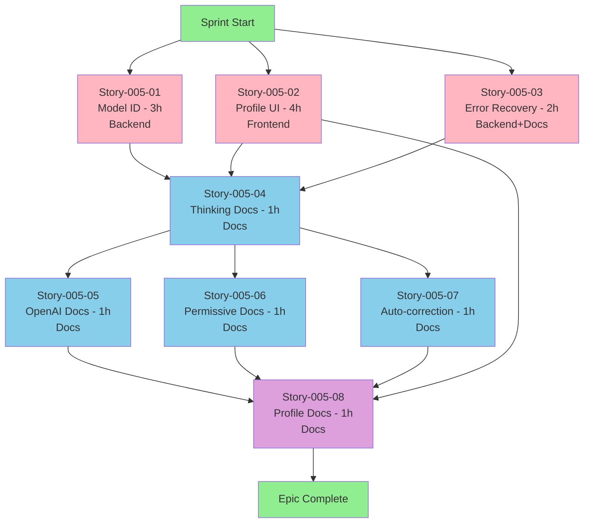

# Epic-005: Execution Plan for Development Team

**Epic**: Epic-005-Gemini-3-Pro-High-Compliance
**Team Size**: 2-3 developers
**Total Effort**: 14 hours
**Target Timeline**: 3-4 days (with parallelization)

---

## 📊 Dependency Analysis

### Technical Dependencies



### Blocking Relationships

| Story | Blocks | Blocked By | Can Parallelize With |
|-------|--------|------------|---------------------|
| 005-01 | 005-04 | None | 005-02, 005-03 |
| 005-02 | 005-04, 005-08 | None | 005-01, 005-03 |
| 005-03 | 005-04 | None | 005-01, 005-02 |
| 005-04 | 005-05, 005-06, 005-07 | 005-01, 005-02, 005-03 | None (blocking) |
| 005-05 | 005-08 | 005-04 | 005-06, 005-07 |
| 005-06 | 005-08 | 005-04 | 005-05, 005-07 |
| 005-07 | 005-08 | 005-04 | 005-05, 005-06 |
| 005-08 | None | ALL | None (final) |

---

## 👥 Team Composition Recommendations

### Recommended Roles

**Developer A: Backend Specialist (Rust)**
- Primary: Rust/backend implementation
- Secondary: Technical documentation
- Skills: Rust, Protocol Buffers, API design

**Developer B: Frontend Specialist (React/TypeScript)**
- Primary: React/TypeScript UI implementation
- Secondary: UX documentation
- Skills: React 19, TypeScript, DaisyUI, i18n

**Developer C: Full-Stack / Technical Writer** (optional)
- Primary: Documentation authoring
- Secondary: Code review, integration
- Skills: Technical writing, Markdown, API documentation

**Minimum Team (2 developers)**:
- Developer A: Backend + Docs (Stories 001, 003, 004, 005, 006, 007)
- Developer B: Frontend + Docs (Story 002, 008)

---

## 🚀 Execution Waves

### Wave 1: CODE Implementation (Parallel - Day 1-2)

**Duration**: 4 hours (longest story: 005-02)
**Parallelization**: ✅ FULL (all stories independent)

```yaml
Developer_A:
  stories:
    - Story-005-01: Model ID Discovery & Implementation (3h)
      type: CODE (Backend - Rust)
      files:
        - src-tauri/src/proxy/mappers/claude/request.rs
      tasks:
        - Discover Model ID via network capture/docs
        - Add 3 constants (GEMINI_3_PRO_HIGH_MODEL_ID, etc.)
        - Update get_model_id() function
        - Write 5 unit tests

    - Story-005-03: Error Recovery Docs & Observability (2h)
      type: CODE + DOCS (Backend - Rust)
      files:
        - docs/architecture/error-recovery.md (NEW)
        - src-tauri/src/proxy/upstream/client.rs (logging)
        - src-tauri/src/proxy/handlers/claude.rs (logging)
      tasks:
        - Write error-recovery.md documentation
        - Add structured retry event logging (6 locations)
        - Test with RUST_LOG=retry_event=info

Developer_B:
  stories:
    - Story-005-02: Profile Presets UI Implementation (4h)
      type: CODE (Frontend - React/TypeScript)
      files:
        - src/components/proxy/ConfigurationProfiles.tsx (NEW)
        - src/pages/ApiProxy.tsx (integration)
        - src/locales/en.json (18 keys)
        - src/locales/zh.json (18 keys)
      tasks:
        - Create ConfigurationProfiles component (~300 lines)
        - Define 8 profile presets (4 base + 4 thinking)
        - Integrate with ApiProxy page
        - Add i18n translations (zh + en)
        - Write 6 unit tests + 2 integration tests
        - Test responsive design (mobile/desktop)

Developer_C (if available):
  role: Code review + documentation prep
  tasks:
    - Review Story-005-01 PR
    - Review Story-005-02 PR
    - Review Story-005-03 PR
    - Prepare thinking-activation.md template for Wave 2
```

**End of Wave 1 Deliverables**:
- ✅ Model ID constants implemented (Story-005-01)
- ✅ Profile UI component working (Story-005-02)
- ✅ Error recovery docs + logging (Story-005-03)

**Sync Point**: Daily standup, merge all PRs before Wave 2

---

### Wave 2A: Foundation Documentation (Sequential - Day 2-3)

**Duration**: 1 hour
**Parallelization**: ❌ BLOCKED (Story-005-04 must complete first)

```yaml
Developer_A OR Developer_C:
  story: Story-005-04: Document Thinking Activation Architecture (1h)
    type: DOCS ONLY
    files:
      - docs/features/thinking-activation.md (NEW ~200 lines)
    tasks:
      - Write Overview section
      - Write Architectural Differences (Gemini vs Claude)
      - Write Activation Flow section (decision tree)
      - Write Budget Management section
      - Write Conflict Detection section
      - Write 5 Configuration Examples
      - Write Troubleshooting Guide
      - Validate all code references

Developer_B:
  parallel_tasks:
    - Polish Profile UI from Story-005-02
    - Fix any bugs from Story-005-02 testing
    - Prepare for Story-005-08 (read specs)
```

**Critical**: Story-005-04 creates `thinking-activation.md` file that Stories 005-05, 005-06, 005-07 will extend

---

### Wave 2B: Extended Documentation (Parallel - Day 3)

**Duration**: 1 hour (all 3 stories same duration)
**Parallelization**: ✅ FULL (all extend same file, no conflicts)

```yaml
Developer_A:
  story: Story-005-05: Document OpenAI Auto-Injection (1h)
    type: DOCS ONLY
    files:
      - docs/features/thinking-activation.md (UPDATE - add section)
    tasks:
      - Add "OpenAI Protocol Auto-Injection" section
      - Write implementation details with code refs
      - Write 4 configuration examples
      - Write Protocol Comparison table
      - Write Troubleshooting (3 issues)

Developer_B:
  story: Story-005-06: Document First-Time Permissive Mode (1h)
    type: DOCS ONLY
    files:
      - docs/features/thinking-activation.md (UPDATE - add section)
    tasks:
      - Add "First-Time Permissive Mode" section
      - Write mode logic explanation
      - Write 3 request flow examples
      - Write Mode Comparison table
      - Write Signature Lifecycle section

Developer_C (or Developer_A after 005-05):
  story: Story-005-07: Document maxOutputTokens Auto-Correction (1h)
    type: DOCS ONLY
    files:
      - docs/features/thinking-activation.md (UPDATE - add section)
    tasks:
      - Add "maxOutputTokens Auto-Correction" section
      - Write constraint explanation
      - Write 3 request examples
      - Write Profile Preset Compliance table
      - Write Configuration Validation Checklist
```

**Merge Strategy**: Each developer works on DIFFERENT sections of same file
- Dev A: Lines ~200-400 (OpenAI section)
- Dev B: Lines ~400-600 (Permissive mode section)
- Dev C: Lines ~600-800 (Auto-correction section)

**Conflict Resolution**: Sections independent, merge sequentially if conflicts

---

### Wave 3: Final Integration (Sequential - Day 3-4)

**Duration**: 1 hour
**Parallelization**: ❌ NONE (depends on ALL previous stories)

```yaml
Developer_B (Frontend owner):
  story: Story-005-08: Update Configuration Profiles Documentation (1h)
    type: DOCS ONLY
    files:
      - docs/features/configuration-profiles.md (NEW ~300 lines)
    tasks:
      - Write Overview (integrating all features)
      - Document 8 profiles (4 base + 4 thinking)
      - Write Use Case Mapping table
      - Write Profile Selection Guide (decision tree)
      - Write Feature Integration section
      - Write Complete Request Examples
      - Write Profile UI Integration section (reference Story-005-02)
      - Write Troubleshooting (3 issues)
      - Cross-validate with ALL previous stories

Developer_A + Developer_C:
  parallel_tasks:
    - Review Story-005-08 PR
    - Validate cross-references accurate
    - Test all documented examples
    - Final QA of Epic-005
```

**End of Wave 3 Deliverables**:
- ✅ Complete configuration profiles guide
- ✅ All Epic-005 features integrated
- ✅ 100% Gemini 3 Pro High compliance

---

## 📅 Timeline Recommendations

### Option 1: 2 Developers (4 days)

```
Day 1 (8h):
  Dev A: Story-005-01 (3h) + Story-005-03 (2h) + Story-005-04 (1h) = 6h
  Dev B: Story-005-02 (4h) = 4h

Day 2 (3h):
  Dev A: Story-005-05 (1h) + Story-005-07 (1h) = 2h
  Dev B: Story-005-06 (1h) = 1h

Day 3 (1h):
  Dev B: Story-005-08 (1h)

Day 4:
  Testing + QA + PR reviews

Total: 3-4 days
```

### Option 2: 3 Developers (3 days) ⭐ RECOMMENDED

```
Day 1 (4h):
  Dev A: Story-005-01 (3h) = 3h
  Dev B: Story-005-02 (4h) = 4h
  Dev C: Story-005-03 (2h) + Code reviews = 3h

Day 2 (3h):
  Dev A: Story-005-04 (1h) → Story-005-05 (1h) = 2h
  Dev B: Story-005-06 (1h) = 1h
  Dev C: Story-005-07 (1h) + Reviews = 2h

Day 3 (2h):
  Dev B: Story-005-08 (1h)
  All: Testing + QA + Final reviews

Total: 3 days (optimal)
```

### Option 3: Aggressive (2 days) - NOT RECOMMENDED

```
Day 1 (9h - OVERLOAD):
  Dev A: 005-01 + 005-03 + 005-04 + 005-05 + 005-07 = 8h
  Dev B: 005-02 + 005-06 = 5h
  Dev C: Code reviews + prep 005-08

Day 2 (2h):
  Dev B: 005-008
  All: QA

Risk: Burnout, quality issues, no buffer for blockers
```

---

## 🎯 Assignment Recommendations

### Scenario 1: 2 Developers Available

**Developer A (Backend + Docs)**:
- ✅ Story-005-01 (Model ID - backend strength)
- ✅ Story-005-03 (Error Recovery - backend + docs)
- ✅ Story-005-04 (Thinking Activation - foundation doc)
- ✅ Story-005-05 (OpenAI Auto-Injection)
- ✅ Story-005-07 (maxOutputTokens Auto-Correction)

**Total**: 9 hours (56% of epic)

**Developer B (Frontend + Docs)**:
- ✅ Story-005-02 (Profile UI - frontend strength)
- ✅ Story-005-06 (First-Time Permissive Mode)
- ✅ Story-005-08 (Configuration Profiles - needs Story-005-02 context)

**Total**: 6 hours (44% of epic)

**Balance**: Reasonable (A has more experience with docs)

---

### Scenario 2: 3 Developers Available ⭐ OPTIMAL

**Developer A (Backend Specialist)**:
- ✅ Story-005-01 (Model ID - 3h)
- ✅ Story-005-04 (Thinking Docs - 1h) [blocking story]
- ✅ Story-005-05 (OpenAI Docs - 1h)

**Total**: 5 hours (33% of epic)
**Role**: Backend implementation + foundation documentation

**Developer B (Frontend Specialist)**:
- ✅ Story-005-02 (Profile UI - 4h)
- ✅ Story-005-06 (Permissive Mode Docs - 1h)
- ✅ Story-005-08 (Profile Docs - 1h) [owns Story-005-02 context]

**Total**: 6 hours (40% of epic)
**Role**: Frontend implementation + UI documentation

**Developer C (Full-Stack / Technical Writer)**:
- ✅ Story-005-03 (Error Recovery - 2h) [hybrid CODE+DOCS]
- ✅ Story-005-07 (Auto-correction Docs - 1h)
- ✅ Code reviews for all stories

**Total**: 3 hours (20% of epic) + reviews
**Role**: Documentation quality + code review

**Balance**: Excellent (distributed by expertise)

---

## 🔄 Daily Standup Template

### Day 1 Standup (Start of Wave 1)

**Dev A**:
- Yesterday: Epic-004 complete, in QA
- Today: Starting Story-005-01 (Model ID discovery)
- Blockers: Need network capture for Model ID (may take 1-2h)

**Dev B**:
- Yesterday: Epic-004 complete
- Today: Starting Story-005-02 (Profile UI component)
- Blockers: None

**Dev C**:
- Yesterday: Epic-004 docs
- Today: Starting Story-005-003 (Error Recovery docs)
- Blockers: None

---

### Day 2 Standup (Sync Point)

**Dev A**:
- Yesterday: ✅ Story-005-01 complete, ✅ Story-005-03 complete
- Today: Starting Story-005-04 (BLOCKING story - foundation doc)
- Blockers: Waiting for Story-005-01 PR approval

**Dev B**:
- Yesterday: ✅ Story-005-02 complete
- Today: Waiting for Story-005-04, polishing Story-005-02
- Blockers: Story-005-06 blocked by Story-005-04

**Dev C**:
- Yesterday: ✅ Story-005-03 complete, reviewed 001/002 PRs
- Today: Preparing for Story-005-07, waiting for Story-005-04
- Blockers: Story-005-07 blocked by Story-005-04

**Action**: Prioritize Story-005-04 completion (Dev A focus)

---

### Day 3 Standup (Wave 2B)

**Dev A**:
- Yesterday: ✅ Story-005-04 complete, ✅ Story-005-05 complete
- Today: Final reviews, supporting Story-005-08
- Blockers: None

**Dev B**:
- Yesterday: ✅ Story-005-06 complete
- Today: Starting Story-005-08 (FINAL story)
- Blockers: None (all dependencies complete)

**Dev C**:
- Yesterday: ✅ Story-005-07 complete
- Today: Reviewing Story-005-08, final QA
- Blockers: None

**Action**: Focus on Story-005-08 completion + final testing

---

## 📋 PR Review Checklist

### Code Stories (001, 002, 003)

- [ ] Code compiles without warnings
- [ ] All unit tests pass
- [ ] Code references match documentation
- [ ] No breaking changes to existing features
- [ ] Code follows project style (Rust: cargo fmt, TS: prettier)
- [ ] Performance acceptable (no regressions)

### Documentation Stories (004, 005, 006, 007, 008)

- [ ] All code references accurate (file paths, line numbers)
- [ ] All examples executable (tested)
- [ ] Cross-references valid (no broken links)
- [ ] Technical accuracy verified
- [ ] Grammar and spelling correct
- [ ] Markdown formatting valid
- [ ] Integration with previous stories correct

---

## ⚠️ Risk Mitigation

### Risk 1: Model ID Discovery Takes Longer Than Expected

**Story**: 005-001
**Probability**: MEDIUM
**Impact**: HIGH (blocks Wave 2)

**Mitigation**:
1. Start network capture on Day 1 morning (parallel with planning)
2. Fallback: Use documentation search if capture fails
3. Fallback: Use 0 (name-based routing) and document limitation
4. Buffer: Add +1h to Dev A Day 1 estimate

### Risk 2: Story-005-04 Bottleneck

**Story**: 005-004
**Probability**: HIGH (sequential blocking story)
**Impact**: HIGH (blocks 005-05, 005-06, 005-07)

**Mitigation**:
1. Assign to most experienced docs writer (Dev A or C)
2. Start immediately after Wave 1 complete
3. Provide template/outline to speed up writing
4. Parallelize other devs on code polishing while 004 in progress

### Risk 3: Merge Conflicts in Wave 2B

**Story**: 005-05, 005-06, 005-07 (all edit thinking-activation.md)
**Probability**: MEDIUM
**Impact**: LOW (sections independent)

**Mitigation**:
1. Assign clear section boundaries (see Wave 2B strategy)
2. Merge sequentially: 005-05 → 005-06 → 005-07
3. Use feature branches: `story-005-05`, `story-005-06`, `story-005-07`
4. Dev C resolves conflicts if any

### Risk 4: Story-005-08 Complexity Underestimated

**Story**: 005-008 (integrates ALL features)
**Probability**: MEDIUM
**Impact**: MEDIUM (delays epic completion)

**Mitigation**:
1. Allocate buffer time (estimate 1h, budget 2h)
2. Pre-read all previous stories before starting
3. Use templates from previous stories
4. Dev A + C available for support

---

## 🎉 Definition of Done (Epic Level)

### Code Complete

- [ ] All 8 stories implemented
- [ ] All PRs merged to main branch
- [ ] All tests passing (unit + integration)
- [ ] No compiler warnings
- [ ] Code coverage ≥85% for new code

### Documentation Complete

- [ ] 3 new documentation files created
- [ ] All code references validated
- [ ] All examples tested and working
- [ ] Cross-references accurate
- [ ] No broken links

### Quality Assurance

- [ ] Manual testing complete (all profiles)
- [ ] Regression testing passed (existing features work)
- [ ] Performance testing passed (no degradation)
- [ ] Accessibility testing passed (WCAG 2.1 AA)

### Compliance Achieved

- [ ] Gemini 3 Pro High compliance: 85.7% → 100%
- [ ] Model ID constants implemented
- [ ] Profile UI functional
- [ ] All features documented

---

## 📞 Communication Plan

### Daily Sync (15 min standup)

**Time**: 10:00 AM daily
**Format**: Synchronous (video call or in-person)
**Topics**: Yesterday/Today/Blockers

### Mid-Wave Sync (30 min)

**Time**: After Wave 1 complete, After Story-005-04 complete
**Format**: Synchronous
**Topics**:
- Review completed stories
- Merge PRs
- Plan next wave
- Address blockers

### Async Updates

**Tool**: Slack/Discord
**Frequency**: As needed
**Use Cases**:
- PR ready for review
- Blocker discovered
- Story complete
- Need help

---

## 🚦 Go/No-Go Criteria

### Start Epic-005

**Prerequisites**:
- ✅ Epic-004 in QA (not blocking)
- ✅ Team capacity available (2-3 developers)
- ✅ All story specs reviewed
- ✅ Timeline approved (3-4 days)

**Decision**: ✅ GO

### Proceed to Wave 2

**Prerequisites**:
- ✅ Story-005-01 merged (Model ID implemented)
- ✅ Story-005-02 merged (Profile UI working)
- ✅ Story-005-03 merged (Error recovery docs + logging)
- ✅ All Wave 1 tests passing

### Proceed to Wave 3

**Prerequisites**:
- ✅ Story-005-04 merged (Foundation doc created)
- ✅ Stories 005-05, 005-06, 005-07 merged
- ✅ thinking-activation.md complete

### Epic Complete

**Prerequisites**:
- ✅ All 8 stories merged
- ✅ QA sign-off
- ✅ Documentation published
- ✅ 100% compliance verified

---

## 📊 Success Metrics

### Velocity Metrics

- **Stories Completed**: Track daily (target: 3 stories/day)
- **PR Merge Time**: Target <4 hours from submission
- **Blocker Resolution**: Target <2 hours

### Quality Metrics

- **Test Coverage**: Target ≥85% for new code
- **Code Review Comments**: Target <5 per PR (indicates good quality)
- **Documentation Accuracy**: 0 technical errors in final review

### Timeline Metrics

- **On-Time Delivery**: Target 3 days (Option 2)
- **Buffer Usage**: Target <20% of estimated time

---

## 🎓 Lessons Learned (Post-Epic Retrospective)

To be filled after Epic-005 completion:

### What Went Well

- [ ] Parallelization strategy effective?
- [ ] Team distribution balanced?
- [ ] Documentation quality high?

### What Could Improve

- [ ] Timeline estimates accurate?
- [ ] Blocker handling effective?
- [ ] Communication sufficient?

### Action Items for Next Epic

- [ ] Adjust estimation formula?
- [ ] Change team composition?
- [ ] Update documentation templates?

---

**Document Version**: 1.0
**Created**: 2026-01-11
**Last Updated**: 2026-01-11
**Owner**: Epic-005 Documentation Team
**Approved By**: [Team Lead to approve]
