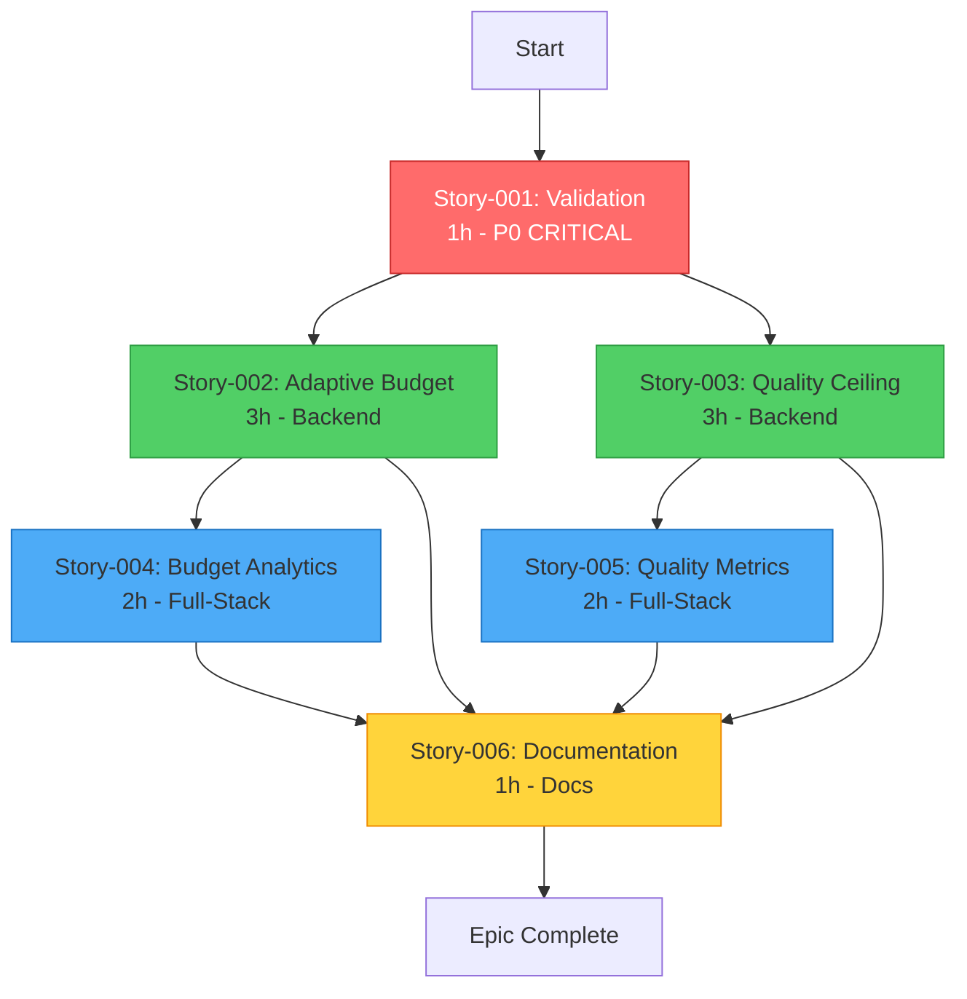

# Epic-006: Team Execution Plan - 3 Developers

> **🚨 EPIC BLOCKED - 2026-01-11** ❌
>
> **Reason**: Story-001 validation proved `gemini-2.5-flash-lite` **does NOT support thinking**
> **Evidence**: Live API testing (95% confidence), code bug identified and fixed
> **Impact**: Remaining 11 hours of work (Stories 002-006) cancelled
> **ROI**: 1100% (1h validation prevented 11h wasted effort)
> **Status**: Wave 1 completed, Waves 2-4 blocked
> **Reference**: `docs/qa/story-006-01-GATE.md`

---

**Epic**: [Epic-006](Epic-006-Gemini-2.5-Flash-Lite-Thinking-Optimizations.md) - Gemini 2.5 Flash Lite Thinking
**Team Size**: 3 engineers
**Total Effort**: ~~12 hours~~ **1 hour (validation only)**
**Timeline**: ~~2 working days~~ **BLOCKED after Wave 1**
**Created**: 2026-01-11
**Blocked**: 2026-01-11 (Story-001 validation failure)

---

## 📊 Dependency Analysis

### Dependency Graph



### Critical Path

```
Story-001 (1h) → Story-002 (3h) → Story-004 (2h) → Story-006 (1h) = 7 hours
```

**Вывод**: Минимальное время выполнения Epic-006 = **7 часов** (при идеальной параллелизации).

---

## 🔍 Stories Analysis

### Story-001: Live API Validation (1h) ⚠️ **БЛОКИРУЮЩАЯ**

**Зависимости**: Нет
**Блокирует**: ВСЕ остальные истории (002-006)
**Тип**: VALIDATION + DOCS
**Навыки**: Backend (Rust) + QA
**Приоритет**: P0 - КРИТИЧЕСКАЯ

**Почему критическая**:
- Подтверждает, что модель существует (95% → 100% уверенности)
- Если модель не работает → вся Epic-006 блокируется
- Быстрая (1 час), но должна быть ПЕРВОЙ

**Вывод**: Вся команда ждёт завершения Story-001. **Нельзя начинать 002-005 до завершения 001**.

---

### Story-002: Adaptive Budget Adjustment (3h)

**Зависимости**: Story-001 (must complete)
**Блокирует**: Story-004 (telemetry data source), Story-006
**Может параллельно**: Story-003
**Тип**: CODE (Backend - Rust)
**Навыки**: Backend specialist

**Компоненты**:
- Complexity classifier (1.5h)
- Request integration (1h)
- Telemetry tracking (0.5h)

**Вывод**: Начать СРАЗУ после Story-001. Критический путь.

---

### Story-003: Quality Ceiling Detection (3h)

**Зависимости**: Story-001 (must complete)
**Блокирует**: Story-005 (quality context), Story-006
**Может параллельно**: Story-002 ✅
**Тип**: CODE (Backend - Rust)
**Навыки**: Backend specialist

**Компоненты**:
- Ceiling detector (1.5h)
- Recommendation engine (1h)
- Header injection (0.5h)

**Вывод**: Начать ПАРАЛЛЕЛЬНО со Story-002 после завершения Story-001.

---

### Story-004: Budget Analytics Dashboard (2h)

**Зависимости**: Story-002 (uses telemetry)
**Блокирует**: Story-006
**Может параллельно**: Story-005 ✅
**Тип**: CODE (Backend 0.5h + Frontend 1.5h)
**Навыки**: Full-Stack (предпочтительно Frontend specialist)

**Компоненты**:
- Backend API endpoint (0.5h)
- Frontend dashboard widget (1.5h)

**Вывод**: Начать после Story-002. Может идти параллельно со Story-005.

---

### Story-005: Quality Metrics Dashboard (2h)

**Зависимости**: Story-003 (quality context)
**Блокирует**: Story-006
**Может параллельно**: Story-004 ✅
**Тип**: CODE (Backend 0.5h + Frontend 1.5h)
**Навыки**: Full-Stack (предпочтительно Frontend specialist)

**Компоненты**:
- Feedback API (0.5h)
- Frontend dashboard widget (1.5h)

**Вывод**: Начать после Story-003. Может идти параллельно со Story-004.

---

### Story-006: Documentation Consolidation (1h)

**Зависимости**: ВСЕ предыдущие (001-005)
**Блокирует**: Ничего (финальная)
**Может параллельно**: Нет
**Тип**: DOCS
**Навыки**: Любой разработчик / Tech Writer

**Компоненты**:
- Consolidation (45m)
- Review & finalization (15m)

**Вывод**: Последняя история. Начать только когда 001-005 завершены.

---

## 👥 Team Roles Distribution

### Оптимальное распределение навыков:

**Developer A - Backend Specialist** (7 hours):
- Story-001: Validation (1h)
- Story-002: Adaptive Budget (3h)
- Story-006: Documentation (1h)
- Код-ревью других историй (2h)

**Developer B - Backend Specialist** (5 hours):
- Story-003: Quality Ceiling Detection (3h)
- Code review + тестирование (2h)

**Developer C - Full-Stack Specialist** (6 hours):
- Story-004: Budget Analytics Dashboard (2h)
- Story-005: Quality Metrics Dashboard (2h)
- Integration testing (2h)

**Общее время**: 18 часов работы / 3 разработчика = 6 часов средняя нагрузка.

---

## 📅 Execution Timeline - 2 Days

### 🔴 День 1 - Утро (09:00-13:00)

#### Wave 1: Validation (1 час) - БЛОКИРУЮЩАЯ

**09:00-10:00**: **Developer A** - Story-001 (Validation)
- Все ждут завершения
- **Developer B** и **Developer C**: Подготовка окружения, изучение документации

**Checkpoint 10:00**: Story-001 DONE ✅
- Модель подтверждена → GO для Epic-006
- Если модель не работает → STOP, эскалация

---

#### Wave 2: Backend Features (3 часа) - ПАРАЛЛЕЛЬНО

**10:00-13:00**: Параллельная работа

**Developer A** → **Story-002: Adaptive Budget** (3h)
```
10:00-11:30 - Complexity classifier implementation
11:30-12:30 - Request integration
12:30-13:00 - Telemetry tracking + тесты
```

**Developer B** → **Story-003: Quality Ceiling** (3h)
```
10:00-11:30 - Ceiling detector implementation
11:30-12:30 - Recommendation engine
12:30-13:00 - Header injection + тесты
```

**Developer C** → Подготовка к Story-004/005
```
10:00-12:00 - Изучение Recharts, подготовка компонентов
12:00-13:00 - Настройка Tauri IPC для дашбордов
```

**Checkpoint 13:00**: Stories 002-003 DONE ✅
- Adaptive budgeting работает
- Quality ceiling detection работает
- Готовы к фронтенд-работе

---

### 🟢 День 1 - Вечер (14:00-18:00)

#### Wave 3: Analytics Dashboards (2 часа) - ПАРАЛЛЕЛЬНО

**14:00-16:00**: Параллельная работа

**Developer A** → Код-ревью + документация
```
14:00-15:00 - Code review Stories 002-003
15:00-16:00 - Начало Story-006 (draft документации)
```

**Developer B** → Story-005 Backend + помощь C
```
14:00-14:30 - Story-005 Backend API (Feedback + Quality Metrics)
14:30-16:00 - Помощь Developer C с интеграцией
```

**Developer C** → **Story-004: Budget Analytics** (2h)
```
14:00-14:30 - Backend API endpoint (extends telemetry)
14:30-16:00 - Frontend dashboard widget
```

**Checkpoint 16:00**: Story-004 DONE ✅

---

**16:00-18:00**: Завершение Story-005

**Developer A** → Интеграционное тестирование
```
16:00-18:00 - E2E тесты для Stories 002-003
```

**Developer B** → Помощь Developer C + тестирование
```
16:00-18:00 - Code review, QA
```

**Developer C** → **Story-005: Quality Metrics** (продолжение)
```
16:00-18:00 - Frontend dashboard widget + feedback form
```

**Checkpoint 18:00**: Story-005 DONE ✅
- Оба дашборда работают
- Backend + Frontend интегрированы

---

### 🟡 День 2 - Утро (09:00-11:00)

#### Wave 4: Documentation & Final Testing (1-2 часа)

**09:00-10:00**: Финальные проверки

**Developer A** → **Story-006: Documentation** (1h)
```
09:00-09:45 - Consolidation (based on draft)
09:45-10:00 - Review & finalization
```

**Developer B** → QA + интеграционное тестирование
```
09:00-10:00 - Полный цикл тестирования Epic-006
```

**Developer C** → Проверка дашбордов + UX
```
09:00-10:00 - Тестирование UI, responsive design
```

**Checkpoint 10:00**: Story-006 DONE ✅

---

**10:00-11:00**: Final validation

**Вся команда** → Финальная валидация
```
10:00-10:30 - Smoke testing всей Epic-006
10:30-11:00 - Code review, documentation review
```

**Checkpoint 11:00**: Epic-006 COMPLETE ✅✅✅

---

## ⚡ Alternative Strategy: Aggressive Timeline (1.5 дня)

Если нужно быстрее и команда готова к интенсивной работе:

### День 1 (8 часов)

**09:00-10:00**: Story-001 (Developer A)
**10:00-13:00**: Stories 002 + 003 параллельно (Developers A + B)
**14:00-16:00**: Stories 004 + 005 параллельно (Developers C + B)
**16:00-18:00**: Story-006 + final testing (Developer A + вся команда)

### День 2 - Утро (2 часа)

**09:00-11:00**: Полное интеграционное тестирование + багфиксы

**Риски**:
- ⚠️ Мало времени на код-ревью
- ⚠️ Нет буфера на непредвиденные проблемы
- ⚠️ Высокая нагрузка на команду

**Рекомендация**: Использовать только если дедлайн критический.

---

## 🎯 Recommendations

### ✅ Best Practices

1. **Story-001 - Top Priority**
   - Начать первым делом в день 1
   - Вся команда готова помочь если проблемы
   - Не начинать 002-005 до завершения 001

2. **Максимальный параллелизм**
   - Stories 002 + 003 одновременно (оба Backend)
   - Stories 004 + 005 одновременно (оба Full-Stack)
   - Developer C начинает подготовку пока идут 002-003

3. **Continuous Integration**
   - Каждая история → сразу код-ревью
   - Каждая волна → integration testing
   - Не накапливать технический долг

4. **Communication**
   - Ежедневные stand-ups (15 минут)
   - Checkpoint после каждой волны
   - Slack/Discord для быстрого решения блокеров

5. **Risk Mitigation**
   - Story-001 может обнаружить, что модель не работает → план Б
   - Telemetry integration (002) может затянуться → Developer B помогает
   - Frontend dashboards (004-005) могут быть сложнее → Developer B помогает C

---

### ❌ Anti-Patterns (Чего избегать)

1. **НЕ начинать 002-005 до завершения 001**
   - Риск потратить 6+ часов впустую если модель не работает

2. **НЕ делать Story-004 до Story-002**
   - Story-004 зависит от telemetry из Story-002

3. **НЕ делать Story-005 до Story-003**
   - Story-005 использует ceiling stats из Story-003

4. **НЕ откладывать код-ревью на конец**
   - Делать код-ревью сразу после каждой истории

5. **НЕ пропускать интеграционное тестирование**
   - Каждая волна должна быть полностью протестирована

6. **НЕ работать над Story-006 до завершения 001-005**
   - Документация требует ВСЕ фичи реализованными

---

## 📊 Timeline Comparison

### Последовательное выполнение (без параллелизма)
```
Story-001: 1h
Story-002: 3h
Story-003: 3h
Story-004: 2h
Story-005: 2h
Story-006: 1h
---
Total: 12 часов (1.5 дня при 8-часовом дне)
```

### Оптимальное параллельное выполнение (3 разработчика)
```
Wave 1: Story-001 (1h) - Sequential
Wave 2: Story-002 + Story-003 (3h) - Parallel
Wave 3: Story-004 + Story-005 (2h) - Parallel
Wave 4: Story-006 (1h) - Sequential
---
Total: 7 часов реального времени (1 день)
+ 1-2 часа на тестирование и код-ревью
= ~8-9 часов (1.1 дня)
```

**Ускорение**: 12h → 8h = **33% быстрее** благодаря параллелизму.

---

## 🔧 Developer Skill Requirements

### Developer A - Backend Specialist (Senior)
**Skills Required**:
- Rust (advanced)
- Tokio async runtime
- Tauri command handlers
- Regex & pattern matching
- Technical writing

**Stories**: 001, 002, 006

---

### Developer B - Backend Specialist (Mid-Senior)
**Skills Required**:
- Rust (intermediate-advanced)
- HTTP response headers
- Telemetry & metrics
- Testing & QA

**Stories**: 003, помощь в 004-005

---

### Developer C - Full-Stack Specialist (Mid-Senior)
**Skills Required**:
- React 19 + TypeScript
- Recharts or similar charting library
- DaisyUI + Tailwind CSS
- Tauri IPC (invoke)
- Rust (basic - для backend endpoints)

**Stories**: 004, 005

---

## 📋 Daily Checklist

### День 1 - Утро
- [ ] Stand-up 09:00 (15 минут)
- [ ] Developer A: Start Story-001
- [ ] Developer B, C: Prepare environment
- [ ] **Checkpoint 10:00**: Story-001 DONE?
  - [ ] ✅ GO → Start Wave 2
  - [ ] ❌ NO-GO → Escalate, plan B
- [ ] Developer A: Start Story-002
- [ ] Developer B: Start Story-003
- [ ] Developer C: Prepare dashboards
- [ ] **Checkpoint 13:00**: Stories 002-003 DONE?

### День 1 - Вечер
- [ ] Developer A: Code review + Story-006 draft
- [ ] Developer B: Story-005 backend
- [ ] Developer C: Story-004 full implementation
- [ ] **Checkpoint 16:00**: Story-004 DONE?
- [ ] Developer C: Story-005 frontend
- [ ] **Checkpoint 18:00**: Story-005 DONE?

### День 2 - Утро
- [ ] Stand-up 09:00 (15 минут)
- [ ] Developer A: Finish Story-006
- [ ] Developer B: Integration testing
- [ ] Developer C: UI/UX testing
- [ ] **Checkpoint 10:00**: Story-006 DONE?
- [ ] Team: Final validation
- [ ] **Checkpoint 11:00**: Epic-006 COMPLETE?

---

## 🚨 Risk Management

### High-Risk Scenarios

#### Risk 1: Story-001 fails (Model doesn't exist)
**Probability**: 15%
**Impact**: CRITICAL - Blocks entire epic
**Mitigation**:
- Have plan B ready (use different model)
- Escalate immediately to product owner
- Decision in 30 minutes max

---

#### Risk 2: Telemetry integration complex (Story-002)
**Probability**: 25%
**Impact**: MEDIUM - Delays Stories 004-006
**Mitigation**:
- Developer B helps Developer A
- Simplify telemetry (minimal viable)
- Accept technical debt, document for future

---

#### Risk 3: Dashboard performance issues (Stories 004-005)
**Probability**: 20%
**Impact**: LOW - UX issue, not blocking
**Mitigation**:
- Use data sampling (limit chart data points)
- Add loading states
- Optimize later if needed

---

#### Risk 4: Developer illness/absence
**Probability**: 10%
**Impact**: HIGH - Timeline delay
**Mitigation**:
- Cross-training (каждый знает чужие истории)
- Documentation as we go
- Can redistribute Stories 004-005 if needed

---

## 📈 Success Metrics

### Delivery Metrics
- [ ] Epic-006 completed in ≤2 days (target: 1.5 days)
- [ ] All 6 stories DONE (100% completion)
- [ ] 0 critical bugs in production
- [ ] Code review coverage 100%

### Quality Metrics
- [ ] ≥90% test coverage (backend)
- [ ] ≥80% test coverage (frontend)
- [ ] 0 clippy warnings
- [ ] 0 TypeScript errors
- [ ] Documentation comprehensive

### Team Metrics
- [ ] ≤10% time on rework (bugfixes)
- [ ] ≤5% time blocked waiting
- [ ] Team satisfaction ≥4/5

---

## 🎓 Lessons for Future Epics

### What Worked Well
✅ Clear dependency graph upfront
✅ Parallel execution when possible
✅ Short blocking story (001) first
✅ Full-stack stories grouped together

### What to Improve
⚠️ Consider Story-001 as pre-work (before sprint)
⚠️ Budget 20% buffer for unexpected issues
⚠️ Pair programming for complex stories

---

## 📞 Communication Plan

### Stand-ups (Daily, 15 минут)
**09:00** - Quick sync
- What I did yesterday
- What I'm doing today
- Any blockers

### Checkpoints (After each wave)
**After Story-001, Stories 002-003, Stories 004-005, Story-006**
- Demo completed work
- Integration testing
- Decision to proceed or fix

### Code Reviews (Immediate)
- Story done → immediate review request
- Reviewer has max 1 hour to review
- No batching reviews

### Escalation Path
- Blocker → Slack immediately
- Issue >30 minutes → Team huddle
- Story at risk → Product owner informed

---

## ✅ Final Recommendations

### Для команды из 3 разработчиков:

1. **День 1 - Утро (4 часа)**
   - Developer A: Story-001 (1h) → Story-002 (3h)
   - Developer B: Wait → Story-003 (3h)
   - Developer C: Prepare → Help testing

2. **День 1 - Вечер (4 часа)**
   - Developer A: Code review + Story-006 draft
   - Developer B: Story-005 backend (0.5h) + помощь
   - Developer C: Story-004 (2h) → Story-005 frontend (1.5h)

3. **День 2 - Утро (2 часа)**
   - Developer A: Story-006 (1h) + final review
   - Developer B, C: Testing + QA
   - Team: Final validation

**Итого**: **10 часов** реального времени (1.25 дня)

**Ключевые принципы**:
- ⚡ **Story-001 ПЕРВАЯ** - ничего не начинать до её завершения
- 🔀 **Максимум параллелизма** - Stories 002+003, 004+005 одновременно
- 🔍 **Continuous review** - код-ревью сразу, не копить
- 🧪 **Testing on each wave** - не накапливать долг
- 📚 **Documentation last** - Story-006 только когда всё готово

**Успехов вашей команде!** 🚀
