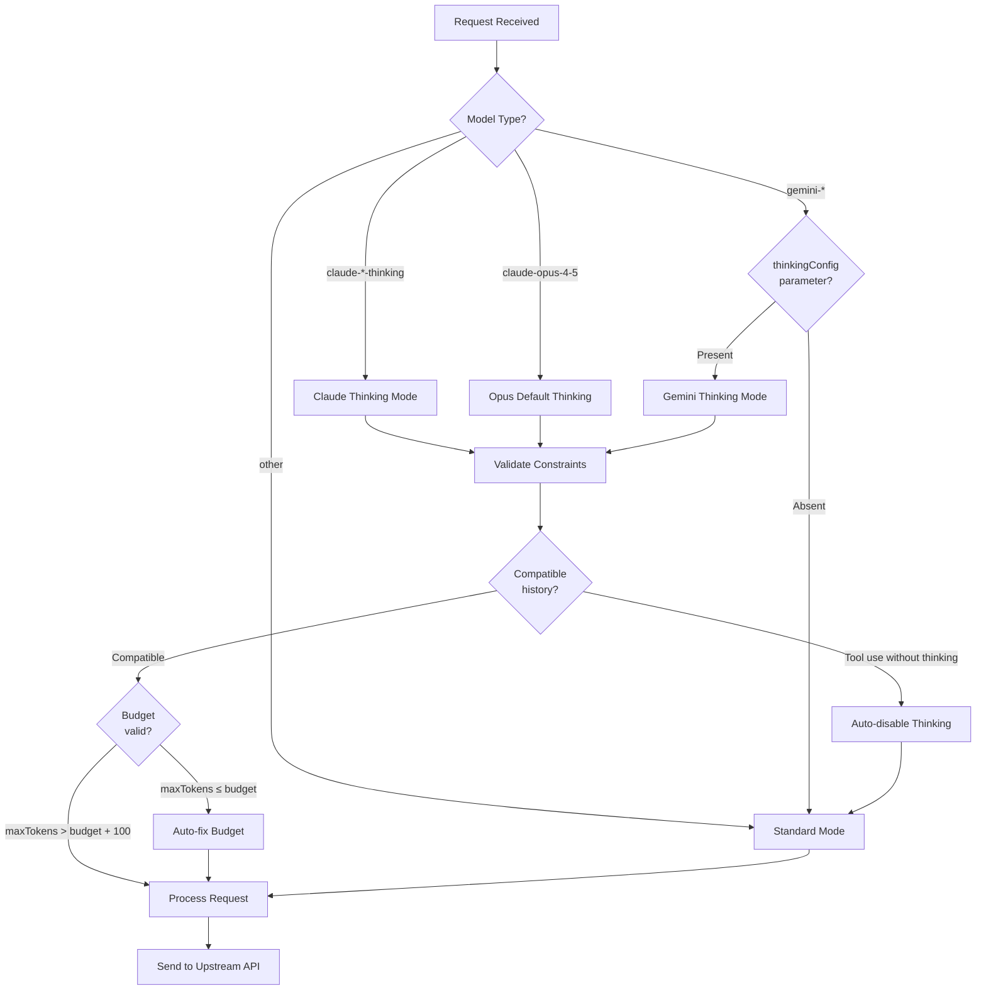

# Thinking Mode Activation Architecture

## Overview

This document describes the thinking mode activation architecture for Gemini 3 Pro High and related models. Thinking mode enables extended reasoning capabilities for AI models, with different activation mechanisms for Claude and Gemini families.

**Key Capabilities**:
- **Extended Reasoning**: Models can generate internal thought processes before producing final output
- **Budget Control**: Configurable token allocation for thinking vs. final response
- **Automatic Validation**: Constraint checking and auto-correction for compatibility
- **Conflict Detection**: Intelligent handling of incompatible conversation histories

**Supported Models**:
- Claude 4.5 Sonnet Thinking (model ID: 334)
- Claude Opus 4.5 (auto-enabled by default)
- Gemini 3 Pro High (parameter-based activation)
- All Gemini models (via `thinkingConfig` parameter)

---

## Architectural Differences: Gemini vs Claude

The fundamental difference between Claude and Gemini thinking activation lies in **how thinking mode is enabled** and **how models are identified**.

### Claude Models (Suffix-based Activation)

**Model Naming Pattern**: Explicit suffix indicates thinking capability
- Standard model: `claude-4.5-sonnet` (Model ID: 333)
- Thinking variant: `claude-4.5-sonnet-thinking` (Model ID: 334)
- Opus models: `claude-opus-4-5` (auto-enabled by default)

**Activation Method**: Model name suffix detection
```rust
// Detection logic in request.rs:337-338
let target_model_supports_thinking =
    mapped_model.contains("-thinking") || is_gemini_thinking_model(&mapped_model);
```

**Model ID Distinction**: Separate IDs for standard vs thinking variants
- Standard Claude 4.5 Sonnet: ID `333`
- Thinking Claude 4.5 Sonnet: ID `334`

**Key Characteristics**:
- ✅ Explicit model name makes intent clear
- ✅ Easy to detect thinking capability from model string
- ❌ Requires different model IDs for standard/thinking variants
- ❌ Model mapping complexity increases with variants

### Gemini Models (Parameter-based Activation)

**Model Naming Pattern**: NO suffix, single model name for all variants
- Base model: `gemini-3-pro-high`
- Thinking mode: `gemini-3-pro-high` (same name!)
- Standard mode: `gemini-3-pro-high` (same name!)

**Activation Method**: `thinkingConfig` parameter in API request
```rust
// Detection logic in request.rs:703-707
fn is_gemini_thinking_model(model: &str) -> bool {
    // All Gemini models support thinking via thinkingConfig
    model.starts_with("gemini-")
}
```

**Model ID Distinction**: Shared ID for all variants
- Gemini 3 Pro High: ID `0` (for both standard and thinking modes)

**Key Characteristics**:
- ✅ Unified model naming reduces complexity
- ✅ Same model ID for all variants
- ✅ Flexible activation via API parameters
- ❌ Thinking capability not obvious from model name
- ❌ Requires parameter inspection to determine mode

### Comparison Table

| Feature | Claude Models | Gemini Models |
|---------|--------------|---------------|
| **Model Naming** | Suffix-based (`-thinking`) | Parameter-based (no suffix) |
| **Thinking Activation** | Via model name detection | Via `thinkingConfig` parameter |
| **Model ID Distinction** | Separate IDs (333 standard, 334 thinking) | Shared ID (0 for all variants) |
| **Capability Detection** | Parse model name suffix | Check all `gemini-*` models |
| **Configuration** | Model selection | API parameter injection |
| **Default Behavior** | Opus 4.5 auto-enabled | Explicit opt-in via parameter |
| **Example Model** | `claude-4.5-sonnet-thinking` | `gemini-3-pro-high` |
| **Budget Control** | Same as Gemini | `thinkingBudget` parameter |

**Architectural Rationale**:

**Claude's Suffix Approach**:
- Emphasizes **model identity** as primary configuration
- Thinking mode is a **model variant**, not a runtime parameter
- Clear separation for billing and quota tracking

**Gemini's Parameter Approach**:
- Emphasizes **runtime configuration** flexibility
- Thinking mode is a **capability** activated on demand
- Single model name reduces mapping complexity

---

## Thinking Activation Flow

### Decision Tree



### Activation Logic

**Step 1: Model Detection** (Lines 321-329)
```rust
// Check if thinking is explicitly enabled in request
let mut is_thinking_enabled = claude_req
    .thinking
    .as_ref()
    .map(|t| t.type_ == "enabled")
    .unwrap_or_else(|| {
        // Auto-enable for Opus 4.5 models
        should_enable_thinking_by_default(&claude_req.model)
    });
```

**Step 2: Model Capability Validation** (Lines 337-354)
```rust
// Check if target model supports thinking
let target_model_supports_thinking =
    mapped_model.contains("-thinking") || is_gemini_thinking_model(&mapped_model);

// Force disable if model doesn't support thinking
if is_thinking_enabled && !target_model_supports_thinking {
    tracing::warn!(
        "[Thinking-Mode] Target model '{}' does not support thinking. Force disabling.",
        mapped_model
    );
    is_thinking_enabled = false;
}
```

**Step 3: History Compatibility Check** (Lines 358-364)
```rust
// Intelligent degradation: check if history is compatible with thinking mode
if is_thinking_enabled {
    let should_disable = should_disable_thinking_due_to_history(&claude_req.messages);
    if should_disable {
        tracing::warn!("[Thinking-Mode] Auto-disabling due to incompatible tool-use history");
        is_thinking_enabled = false;
    }
}
```

**Step 4: Budget Validation and Auto-Fix** (Lines 1574-1593)
```rust
// Validate budget constraint: maxOutputTokens must be > thinkingBudget + 100
if max_tokens <= clamped_budget {
    let adjusted = clamped_budget + 100;

    violations.record_budget_violation();

    tracing::warn!(
        "[Thinking-Budget] ⚠️ Constraint violation: maxOutputTokens ({}) <= thinkingBudget ({}). \
         Auto-fixing to {} to maintain compatibility.",
        max_tokens, clamped_budget, adjusted
    );

    adjusted
} else {
    max_tokens
}
```

### Code Locations

**Primary Implementation**: `src-tauri/src/proxy/mappers/claude/request.rs`

| Function | Lines | Purpose |
|----------|-------|---------|
| `map_to_gemini_request` | 300-354 | Main thinking activation logic |
| `is_gemini_thinking_model` | 703-707 | Gemini model detection |
| `should_enable_thinking_by_default` | 675-693 | Opus auto-enable logic |
| `should_disable_thinking_due_to_history` | 644-668 | History compatibility check |
| `build_generation_config` | 1560-1617 | Budget validation and auto-fix |

---

## Budget Management

### Budget Constraints

**Minimum Requirement**: `thinkingBudget + 100 ≤ maxOutputTokens`

**Rationale**: The model needs at least 100 tokens beyond the thinking budget for the final response content.

**Model-Specific Limits**:
```rust
// Lines 1560-1568
let clamped_budget = if mapped_model.contains("gemini-3-pro") {
    budget.min(24576)  // Gemini 3 Pro max: 24576 tokens
} else if mapped_model.contains("claude") {
    budget.min(32000)  // Claude models max: 32000 tokens
} else if mapped_model.contains("gemini") {
    budget.min(32000)  // Other Gemini models max: 32000 tokens
} else {
    budget
};
```

**Auto-Correction**: Enabled by default for backward compatibility
- **Trigger**: When `maxOutputTokens ≤ thinkingBudget`
- **Action**: Set `maxOutputTokens = thinkingBudget + 100`
- **Logging**: Warning with guidance for client to fix configuration

### Budget Calculation Examples

#### Example 1: Valid Budget
```rust
thinking_budget = 4096
max_tokens = 8192
// Valid: 8192 > 4096 + 100 ✅
// Result: No adjustment needed
```

#### Example 2: Budget Violation (Auto-fixed)
```rust
thinking_budget = 4096
max_tokens = 4000
// Invalid: 4000 ≤ 4096 ❌
// Auto-fix: max_tokens → 4196 (4096 + 100)
```

#### Example 3: Model Limit Clamping
```rust
thinking_budget = 40000  // Exceeds model limit
model = "gemini-3-pro-high"
// Clamped: 40000 → 24576 (model max)
// Required max_tokens: 24676 minimum
```

### Budget Violation Tracking

Budget violations are tracked for monitoring and metrics:

```rust
// Lines 1577-1578
violations.record_budget_violation();
```

**Integration Point**: Story #8 ProxyMonitor metrics
- Violation counters exposed via monitoring endpoints
- Used for client configuration health checks

---

## Conflict Detection & Resolution

### Incompatible Tool History

**Problem**: Conversation history contains tool calls WITHOUT thinking blocks

**Impact**: Enabling thinking mode with incompatible history causes upstream API errors:
```
"final assistant message must start with a thinking block"
```

**Detection Logic** (Lines 644-668):
```rust
fn should_disable_thinking_due_to_history(messages: &[Message]) -> bool {
    // Search backwards for the last assistant message
    for msg in messages.iter().rev() {
        if msg.role == "assistant" {
            if let MessageContent::Array(blocks) = &msg.content {
                let has_tool_use = blocks.iter()
                    .any(|b| matches!(b, ContentBlock::ToolUse { .. }));
                let has_thinking = blocks.iter()
                    .any(|b| matches!(b, ContentBlock::Thinking { .. }));

                // Incompatible: tool use without thinking block
                if has_tool_use && !has_thinking {
                    return true;
                }
            }
            return false;
        }
    }
    false
}
```

**Resolution Strategy**: Automatic thinking mode disable for current request
- **Preserves Compatibility**: Prevents API errors
- **Temporary Disable**: Only affects current request
- **Logged Decision**: Warns about incompatible state

**Example Scenario**:
```
1. User starts conversation with standard model (no thinking)
2. Tool calls are made without thinking blocks in history
3. User switches to thinking model
4. System detects incompatible history
5. Auto-disables thinking for this request to prevent errors
```

---

## Configuration Examples

### Example 1: Standard Request (No Thinking)

**Input**:
```json
{
  "model": "gemini-3-pro-high",
  "messages": [
    {"role": "user", "content": "Explain quantum computing"}
  ],
  "max_tokens": 8192
}
```

**Result**: Standard mode, no `thinkingConfig` parameter
```json
{
  "model": "gemini-3-pro-high",
  "contents": [...],
  "generationConfig": {
    "maxOutputTokens": 8192
  }
  // No thinkingConfig
}
```

---

### Example 2: Thinking Request (Explicit)

**Input**:
```json
{
  "model": "gemini-3-pro-high",
  "messages": [
    {"role": "user", "content": "Solve this complex problem step by step"}
  ],
  "max_tokens": 16384,
  "thinking": {
    "type": "enabled",
    "budget_tokens": 4096
  }
}
```

**Result**: Thinking enabled, `thinkingConfig` injected
```json
{
  "model": "gemini-3-pro-high",
  "contents": [...],
  "generationConfig": {
    "maxOutputTokens": 16384,
    "thinkingConfig": {
      "thinkingBudget": 4096
    }
  }
}
```

---

### Example 3: Auto-Fix Budget Violation

**Input**:
```json
{
  "model": "gemini-3-pro-high",
  "max_tokens": 4000,
  "thinking": {
    "type": "enabled",
    "budget_tokens": 4096
  }
}
```

**Problem**: `maxTokens (4000) ≤ thinkingBudget (4096)` ❌

**Auto-Fixed Request**:
```json
{
  "model": "gemini-3-pro-high",
  "generationConfig": {
    "maxOutputTokens": 4196,  // Auto-fixed: 4096 + 100
    "thinkingConfig": {
      "thinkingBudget": 4096
    }
  }
}
```

**Warning Logged**:
```
[Thinking-Budget] ⚠️ Constraint violation: maxOutputTokens (4000) <= thinkingBudget (4096).
Auto-fixing to 4196 to maintain compatibility. Client should fix configuration to prevent this warning.
```

---

### Example 4: Thinking Disabled (Incompatible History)

**Input**:
```json
{
  "model": "gemini-3-pro-high",
  "messages": [
    {
      "role": "assistant",
      "content": [
        {
          "type": "tool_use",
          "id": "tool_123",
          "name": "search",
          "input": {"query": "example"}
        }
      ]
      // ❌ No thinking block in tool use history!
    },
    {
      "role": "user",
      "content": "What did you find?"
    }
  ],
  "thinking": {"type": "enabled"}
}
```

**Detection**: Last assistant message has tool use WITHOUT thinking block

**Result**: Thinking auto-disabled to prevent errors
```json
{
  "model": "gemini-3-pro-high",
  "contents": [...],
  "generationConfig": {
    "maxOutputTokens": 8192
  }
  // No thinkingConfig (auto-disabled)
}
```

**Warning Logged**:
```
[Thinking-Mode] Automatically disabling thinking checks due to incompatible tool-use history (mixed application)
```

---

### Example 5: Claude Thinking (For Comparison)

**Input**:
```json
{
  "model": "claude-4.5-sonnet-thinking",
  "messages": [
    {"role": "user", "content": "Complex reasoning task"}
  ]
}
```

**Detection**: Model name contains `-thinking` suffix

**Result**: Thinking enabled via model name (no separate parameter)
```json
{
  "model": "gemini-3-pro-high",  // Mapped to Gemini
  "contents": [...],
  "generationConfig": {
    "thinkingConfig": {
      "thinkingBudget": 8000  // Default budget
    }
  }
}
```

**Key Difference**: Claude uses model name, Gemini uses parameter

---

## Troubleshooting

### Issue 1: Thinking Not Activated

**Symptoms**: `thinkingConfig` missing in upstream request despite thinking request

**Possible Causes**:
1. Model doesn't support thinking (standard Claude model without `-thinking` suffix)
2. Incompatible tool history detected (tool use without thinking blocks)
3. Budget constraint violation auto-disabled thinking

**Diagnostic Steps**:
1. Check logs for thinking mode detection:
   ```
   [Epic-004-Validation] Thinking mode: enabled=false, model_supports=true, final_state=false
   ```

2. Check for history incompatibility warning:
   ```
   [Thinking-Mode] Automatically disabling thinking due to incompatible tool-use history
   ```

3. Verify model name:
   - Claude: Must contain `-thinking` suffix
   - Gemini: Any `gemini-*` model supports thinking

**Solutions**:
- **Claude**: Use thinking variant model (`claude-4.5-sonnet-thinking` instead of `claude-4.5-sonnet`)
- **History Issue**: Start new conversation or accept auto-disable for compatibility
- **Gemini**: Ensure `thinking.type = "enabled"` in request

---

### Issue 2: Budget Violation Warnings

**Symptoms**: Warning logs about constraint violations

```
[Thinking-Budget] ⚠️ Constraint violation: maxOutputTokens (4000) <= thinkingBudget (4096).
Auto-fixing to 4196 to maintain compatibility. Client should fix configuration to prevent this warning.
```

**Causes**:
- Client configuration error: `max_tokens` set too low
- Auto-correction triggered to prevent upstream API errors

**Solutions**:
1. **Fix Client Configuration**:
   ```json
   {
     "max_tokens": 8192,  // Must be > thinking_budget + 100
     "thinking": {
       "budget_tokens": 4096
     }
   }
   ```

2. **Verify Model Limits**:
   - Gemini 3 Pro: Max 24576 thinking budget
   - Gemini 3 Pro High: Max 32000 thinking budget
   - Claude models: Max 32000 thinking budget

3. **Monitor Violation Metrics**:
   - Check ProxyMonitor for violation counters
   - High violation rates indicate client configuration issues

**Prevention**: Set `max_tokens` ≥ `thinking_budget + 100` in all requests

---

### Issue 3: Thinking Disabled Despite Request

**Symptoms**: Request has `thinking.type = "enabled"` but no `thinkingConfig` in upstream request

**Causes**:
1. **Model Doesn't Support Thinking**:
   - Claude standard model used instead of thinking variant
   - Non-Gemini model doesn't support thinking

2. **Incompatible History**:
   - Previous tool calls made without thinking blocks
   - Auto-disabled to prevent API errors

**Diagnostic Logs**:
```
[Thinking-Mode] Target model 'claude-4.5-sonnet' does not support thinking. Force disabling thinking mode.
```
or
```
[Thinking-Mode] Detected ToolUse without Thinking in history. Requesting disable.
```

**Solutions**:
1. **Use Thinking-Capable Model**:
   - Claude: `claude-4.5-sonnet-thinking` (ID: 334)
   - Gemini: Any `gemini-*` model

2. **Handle History Conflicts**:
   - Accept auto-disable for current request
   - Start new conversation for clean thinking mode
   - Avoid mixing thinking and non-thinking models in same conversation

3. **Verify Model Mapping**:
   - Check model mapping configuration
   - Ensure thinking models map to thinking-capable upstream models

---

<!-- ========== Wave 2B Extension Points ========== -->

## OpenAI Protocol Auto-Injection

### Overview

The OpenAI protocol does not natively support thinking mode parameters. Unlike the Claude protocol which uses `thinking.type` and `thinking.budget_tokens`, OpenAI-style requests have no built-in mechanism for extended reasoning configuration.

**Problem**: Third-party applications (Claude Code, Cursor, Cherry Studio) using OpenAI protocol cannot activate Gemini's thinking capabilities.

**Solution**: The proxy automatically detects OpenAI protocol requests targeting Gemini 3 models and injects `thinkingConfig` parameters during protocol conversion.

### Why Auto-Injection Exists

**Protocol Limitation**: OpenAI API specification has no thinking parameters
- No equivalent to Claude's `thinking.type` field
- No budget allocation mechanism
- No built-in extended reasoning controls

**Gemini Capability Gap**: Gemini 3 Pro supports thinking via native API but not through OpenAI compatibility layer

**User Experience**: Without auto-injection, OpenAI clients would be locked out of Gemini's most powerful reasoning features despite routing through the proxy

### Detection Logic

**Model Pattern Matching** (`src-tauri/src/proxy/mappers/openai/request.rs:247-250`)
```rust
let is_gemini_3_thinking = mapped_model.contains("gemini-3")
    && (mapped_model.ends_with("-high")
        || mapped_model.ends_with("-low")
        || mapped_model.contains("-pro"));
```

**Trigger Conditions**:
1. Model name contains `"gemini-3"` prefix
2. Model ends with `-high`, `-low`, or contains `-pro`

**Matched Models**:
- `gemini-3-pro-high` ✅
- `gemini-3-pro-low` ✅
- `gemini-3-pro` ✅
- `gemini-1.5-pro` ❌ (not Gemini 3)
- `gemini-3-flash` ❌ (no pro/high/low suffix)

### Transformation Process

#### Step 1: OpenAI Request Received

**Input** (OpenAI format):
```json
{
  "model": "gemini-3-pro-high",
  "messages": [
    {"role": "user", "content": "Solve this complex problem"}
  ],
  "max_tokens": 8192,
  "temperature": 0.7
}
```

**Note**: No `thinking_budget` parameter exists in OpenAI protocol

#### Step 2: Auto-Injection Triggered

**Detection** (`request.rs:247-250`):
```rust
// Model name: "gemini-3-pro-high"
// contains("gemini-3") → true
// ends_with("-high") → true
// Result: is_gemini_3_thinking = true
```

#### Step 3: thinkingConfig Injection

**Code** (`request.rs:264-272`):
```rust
if is_gemini_3_thinking {
    gen_config["thinkingConfig"] = json!({
        "includeThoughts": true,
        "thinkingBudget": 16000
    });
    tracing::debug!(
        "[OpenAI-Request] Injected thinkingConfig for Gemini 3 Pro: thinkingBudget=16000"
    );
}
```

**Result**: `generationConfig` extended with thinking parameters

#### Step 4: Gemini Request Generated

**Output** (Gemini internal format):
```json
{
  "project": "project-123",
  "model": "gemini-3-pro-high",
  "request": {
    "contents": [...],
    "generationConfig": {
      "maxOutputTokens": 8192,
      "temperature": 0.7,
      "thinkingConfig": {
        "includeThoughts": true,
        "thinkingBudget": 16000
      }
    }
  }
}
```

**Added Parameters**:
- `includeThoughts: true` - Enables thought output in response
- `thinkingBudget: 16000` - Allocates 16K tokens for reasoning

### Configuration Options

**Current Implementation**: Fixed default values

| Parameter | Default Value | Configurable |
|-----------|---------------|--------------|
| `includeThoughts` | `true` | ❌ Fixed |
| `thinkingBudget` | `16000` | ❌ Fixed |
| Detection Pattern | Gemini 3 Pro variants | ❌ Fixed |

**Rationale for Fixed Defaults**:
- **16K Budget**: Balances reasoning depth with response space
  - Leaves 48K tokens for final response (when `max_tokens=64000`)
  - Sufficient for most complex reasoning tasks
- **Always Include Thoughts**: Transparency in reasoning process
  - Users can observe model's thinking process
  - Debugging and validation enabled by default

**Future Enhancement Opportunity** (Story-005-08):
- Allow custom `thinking_budget` via OpenAI extension fields
- Model-specific budget presets (Pro High vs Pro Low)
- User-configurable defaults in proxy settings

### Request Transformation Examples

#### Example 1: Standard Chat Request

**Before** (OpenAI protocol):
```json
{
  "model": "gemini-3-pro-high",
  "messages": [
    {"role": "user", "content": "Explain quantum entanglement"}
  ],
  "max_tokens": 8192
}
```

**After** (Gemini protocol):
```json
{
  "project": "test-project",
  "model": "gemini-3-pro-high",
  "request": {
    "contents": [
      {
        "role": "user",
        "parts": [{"text": "Explain quantum entanglement"}]
      }
    ],
    "generationConfig": {
      "maxOutputTokens": 8192,
      "temperature": 1.0,
      "topP": 1.0,
      "thinkingConfig": {
        "includeThoughts": true,
        "thinkingBudget": 16000
      }
    }
  }
}
```

**Change Summary**:
- ✅ `thinkingConfig` auto-injected
- ✅ Budget set to 16000 tokens
- ✅ `includeThoughts` enabled

#### Example 2: Non-Gemini 3 Model (No Injection)

**Before** (OpenAI protocol):
```json
{
  "model": "gemini-1.5-flash",
  "messages": [
    {"role": "user", "content": "Quick question"}
  ],
  "max_tokens": 4096
}
```

**After** (Gemini protocol):
```json
{
  "project": "test-project",
  "model": "gemini-1.5-flash",
  "request": {
    "contents": [
      {
        "role": "user",
        "parts": [{"text": "Quick question"}]
      }
    ],
    "generationConfig": {
      "maxOutputTokens": 4096,
      "temperature": 1.0,
      "topP": 1.0
      // No thinkingConfig - model doesn't match pattern
    }
  }
}
```

**Change Summary**:
- ❌ No `thinkingConfig` injection
- ℹ️ Model name doesn't match Gemini 3 Pro pattern
- ✅ Standard processing without thinking mode

#### Example 3: Image Generation Request (Injection Prevented)

**Before** (OpenAI protocol):
```json
{
  "model": "gemini-3-pro-high",
  "messages": [
    {"role": "user", "content": "Generate an image of a sunset"}
  ]
}
```

**After** (Gemini protocol - with image config):
```json
{
  "project": "test-project",
  "model": "gemini-3-pro-image",
  "request": {
    "contents": [...],
    "generationConfig": {
      "candidateCount": 1,
      "imageConfig": {
        "aspectRatio": "1:1"
      }
      // thinkingConfig removed - incompatible with image generation
    }
  }
}
```

**Special Handling** (`request.rs:397-409`):
```rust
if let Some(image_config) = config.image_config {
    // Remove incompatible fields for image generation
    gen_obj.remove("thinkingConfig");
    gen_obj.remove("responseMimeType");
    gen_obj.remove("responseModalities");
    gen_obj.insert("imageConfig".to_string(), image_config);
}
```

**Change Summary**:
- ❌ `thinkingConfig` removed despite Gemini 3 model
- ✅ Image generation takes precedence
- ℹ️ Thinking mode incompatible with image generation requests

### Edge Cases and Limitations

#### Edge Case 1: Low max_tokens with Auto-Injection

**Scenario**: Client requests low `max_tokens` value

**Input**:
```json
{
  "model": "gemini-3-pro-high",
  "max_tokens": 2048
}
```

**Problem**: `thinkingBudget=16000` exceeds `maxOutputTokens=2048`

**Behavior**: Upstream API may error or auto-adjust budget

**Workaround**: Future enhancement to clamp `thinkingBudget` based on `max_tokens`:
```rust
// Proposed enhancement (not yet implemented)
let thinking_budget = if max_tokens < 20000 {
    (max_tokens as f64 * 0.5) as i32  // Use 50% for thinking
} else {
    16000  // Default for large contexts
};
```

#### Edge Case 2: Model Name Aliasing

**Scenario**: User-defined model mapping changes model name

**Input**:
```json
{
  "model": "my-custom-model"  // Maps to "gemini-3-pro-high"
}
```

**Detection**:
```rust
// Uses mapped_model, not original request.model
let mapped_model = resolve_model_route(&request.model, &custom_mapping);
let is_gemini_3_thinking = mapped_model.contains("gemini-3") && ...;
```

**Behavior**: ✅ Auto-injection works with mapped model name
- Detection uses `mapped_model` from model routing
- Custom aliases fully supported

#### Edge Case 3: Conflicting Tool Definitions

**Scenario**: Request includes both tools AND thinking config

**Input**:
```json
{
  "model": "gemini-3-pro-high",
  "tools": [{"type": "function", "function": {...}}]
}
```

**Behavior**: ✅ Both features coexist
- `thinkingConfig` injected into `generationConfig`
- Tools converted to `functionDeclarations` in separate field
- No conflict - different configuration sections

**Result**:
```json
{
  "generationConfig": {
    "thinkingConfig": {"thinkingBudget": 16000}
  },
  "tools": [
    {"functionDeclarations": [...]}
  ]
}
```

#### Edge Case 4: Temperature Override Interaction

**Scenario**: High temperature with thinking mode

**Input**:
```json
{
  "model": "gemini-3-pro-high",
  "temperature": 2.0  // Very high creativity
}
```

**Behavior**: ✅ No interaction issues
- `temperature` passed directly to `generationConfig`
- `thinkingConfig` added independently
- Model handles parameter combination

**Note**: High temperature may reduce thinking coherence but proxy doesn't enforce constraints

#### Edge Case 5: Budget Exceeds Model Limit

**Current Default**: `thinkingBudget: 16000`

**Model Limits** (from `claude/request.rs:1560-1568`):
- Gemini 3 Pro: Max 24576 tokens
- Other Gemini models: Max 32000 tokens

**Status**: ✅ Default 16000 is safe for all models

**Future Risk**: If default increased to >24576:
```rust
// Potential enhancement needed
let budget_limit = if mapped_model.contains("gemini-3-pro") {
    24576
} else {
    32000
};
let safe_budget = 16000.min(budget_limit);
```

### Logging and Debugging

**Debug Log Output** (`request.rs:269-271`):
```
[OpenAI-Request] Injected thinkingConfig for Gemini 3 Pro: thinkingBudget=16000
```

**Diagnostic Information**:
- Model detection: `request.rs:24-30` logs original and mapped models
- Config injection: `request.rs:269-271` confirms thinking activation
- Transformed request: `openai.rs:98-100` logs full Gemini body (debug level)

**Example Log Sequence**:
```
[Debug] OpenAI Request: original='gemini-3-pro-high', mapped='gemini-3-pro-high', type='text', has_image_config=false
[OpenAI-Request] Injected thinkingConfig for Gemini 3 Pro: thinkingBudget=16000
[OpenAI-Request] Transformed Gemini Body:
{
  "project": "test-project",
  "request": {
    "generationConfig": {
      "thinkingConfig": {
        "includeThoughts": true,
        "thinkingBudget": 16000
      }
    }
  }
}
```

### Comparison: OpenAI vs Claude Protocol

| Feature | OpenAI Protocol | Claude Protocol |
|---------|----------------|-----------------|
| **Thinking Parameter** | ❌ Not supported | ✅ `thinking.type` |
| **Budget Control** | ❌ Not supported | ✅ `thinking.budget_tokens` |
| **Auto-Injection** | ✅ Required for Gemini 3 | ❌ Not needed (native) |
| **Detection Method** | Model name pattern | Request parameter |
| **Budget Default** | 16000 (fixed) | Client-specified |
| **User Visibility** | Transparent (logs only) | Explicit in request |

**Key Difference**: OpenAI protocol requires proxy intelligence to bridge capability gap, while Claude protocol has first-class thinking support.

### Code References

**Primary Implementation**:
- Detection: `src-tauri/src/proxy/mappers/openai/request.rs:247-250`
- Injection: `src-tauri/src/proxy/mappers/openai/request.rs:264-272`
- Image Cleanup: `src-tauri/src/proxy/mappers/openai/request.rs:397-409`

**Related Code**:
- Handler Entry: `src-tauri/src/proxy/handlers/openai.rs:17-309` (chat completions)
- Model Routing: `src-tauri/src/proxy/common/model_mapping.rs` (model name resolution)
- Budget Limits: `src-tauri/src/proxy/mappers/claude/request.rs:1560-1568` (for comparison)

**Test Coverage**:
- Basic Request: `src-tauri/src/proxy/mappers/openai/request.rs:450-491`

---

## First-Time Permissive Mode

### Overview

First-Time Permissive Mode is a **user experience optimization** that allows thinking mode to activate successfully on the **first request** in a conversation, even when the request doesn't contain explicit thinking configuration in the conversation history.

**Key Principle**: "Make it work first, validate second"

**Why It Exists**:
- **Reduced Configuration Friction**: Users don't need to pre-configure thinking mode before the first request
- **Better First-Time Experience**: Thinking mode "just works" without setup requirements
- **Graceful Degradation**: Strict validation only applies when necessary (function calls with history)
- **Progressive Enhancement**: Validation strictness increases as conversation complexity grows

**Behavioral Difference**:
- **First Request**: Permissive mode - signature validation deferred to upstream API
- **Subsequent Requests with Tools**: Strict mode - local signature validation enforced

---

### How It Works

#### Detection Logic

The system differentiates between "first-time" and "continuation" requests by checking for thinking blocks in conversation history:

**Code Location**: `src-tauri/src/proxy/mappers/claude/request.rs` (Lines 371-404)

```rust
// Check if conversation history contains thinking blocks
let has_thinking_history = claude_req.messages.iter().any(|m| {
    if let MessageContent::Array(blocks) = &m.content {
        return blocks
            .iter()
            .any(|b| matches!(b, ContentBlock::Thinking { .. }));
    }
    false
});

// Check if there are function calls in the request
let has_function_calls = claude_req.messages.iter().any(|m| {
    if let MessageContent::Array(blocks) = &m.content {
        blocks
            .iter()
            .any(|b| matches!(b, ContentBlock::ToolUse { .. }))
    } else {
        false
    }
});

// [FIX #298] For first-time thinking requests (no thinking history),
// we use permissive mode and let upstream handle validation.
// We only enforce strict signature checks when function calls are involved.
let needs_signature_check = has_function_calls;

if !has_thinking_history && is_thinking_enabled {
    tracing::info!(
        "[Thinking-Mode] First thinking request detected. Using permissive mode - \
         signature validation will be handled by upstream API."
    );
}
```

#### Validation Strategy

**Two-Tier Validation Approach**:

| Condition | Validation Mode | Behavior |
|-----------|----------------|----------|
| First request (no thinking history) | **Permissive** | Skip local signature checks, defer to upstream |
| Subsequent requests with tools | **Strict** | Enforce local signature validation before upstream |
| Subsequent requests without tools | **Permissive** | No signature requirements |

**Signature Check Logic** (Lines 406-414):

```rust
if needs_signature_check
    && !has_valid_signature_for_function_calls(&claude_req.messages, &global_sig)
{
    tracing::warn!(
        "[Thinking-Mode] [FIX #295] No valid signature found for function calls. \
         Disabling thinking to prevent Gemini 3 Pro rejection."
    );
    is_thinking_enabled = false;
}
```

**Signature Validation Function** (Lines 714-738):

```rust
const MIN_SIGNATURE_LENGTH: usize = 50;

fn has_valid_signature_for_function_calls(
    messages: &[Message],
    global_sig: &Option<String>,
) -> bool {
    // 1. Check global store
    if let Some(sig) = global_sig {
        if sig.len() >= MIN_SIGNATURE_LENGTH {
            return true;
        }
    }

    // 2. Check message history for thinking blocks with signatures
    for msg in messages.iter().rev() {
        if let MessageContent::Array(blocks) = &msg.content {
            for block in blocks {
                if let ContentBlock::Thinking { thinking, signature } = block {
                    if let Some(sig) = signature {
                        if sig.len() >= MIN_SIGNATURE_LENGTH {
                            return true;
                        }
                    }
                }
            }
        }
    }

    false
}
```

---

### Practical Examples

#### Example 1: First Request Success (Permissive Mode)

**Scenario**: User makes first thinking request without any conversation history

**Input**:
```json
{
  "model": "gemini-3-pro-high",
  "messages": [
    {
      "role": "user",
      "content": "Solve this complex math problem step by step"
    }
  ],
  "thinking": {
    "type": "enabled",
    "budget_tokens": 4096
  }
}
```

**System Behavior**:
1. Detects `has_thinking_history = false` (no prior thinking blocks)
2. Detects `has_function_calls = false` (no tool usage)
3. Sets `needs_signature_check = false` (permissive mode activated)
4. Logs: `"[Thinking-Mode] First thinking request detected. Using permissive mode"`
5. Allows thinking activation without signature validation
6. Upstream API validates request structure

**Result**: ✅ Request succeeds, thinking mode enabled

**Upstream Request**:
```json
{
  "model": "gemini-3-pro-high",
  "contents": [...],
  "generationConfig": {
    "maxOutputTokens": 8192,
    "thinkingConfig": {
      "thinkingBudget": 4096
    }
  }
}
```

---

#### Example 2: First Request with Tools (Still Permissive)

**Scenario**: User makes first thinking request WITH tool definitions (but no tool call history)

**Input**:
```json
{
  "model": "gemini-3-pro-high",
  "messages": [
    {
      "role": "user",
      "content": "Search for information about quantum computing"
    }
  ],
  "tools": [
    {
      "type": "function",
      "function": {
        "name": "web_search",
        "description": "Search the web"
      }
    }
  ],
  "thinking": {
    "type": "enabled"
  }
}
```

**System Behavior**:
1. Detects `has_thinking_history = false` (first thinking request)
2. Detects `has_function_calls = false` (no tool USE in history, only definitions)
3. Sets `needs_signature_check = false` (tools defined but not called yet)
4. Permissive mode activated
5. Logs: `"[Thinking-Mode] First thinking request detected. Using permissive mode"`

**Result**: ✅ Request succeeds, thinking mode enabled

**Why This Works**: Tool **definitions** don't require signatures, only tool **calls** do. On the first request, there are no tool calls in history yet.

---

#### Example 3: Second Request with Tool Calls (Strict Mode Activated)

**Scenario**: Continuation request with function calls in history but missing signature

**Input**:
```json
{
  "model": "gemini-3-pro-high",
  "messages": [
    {
      "role": "user",
      "content": "Search for quantum computing"
    },
    {
      "role": "assistant",
      "content": [
        {
          "type": "tool_use",
          "id": "tool_123",
          "name": "web_search",
          "input": {"query": "quantum computing"}
        }
      ]
      // ❌ NO thinking block with signature!
    },
    {
      "role": "user",
      "content": "Summarize the results"
    }
  ],
  "thinking": {
    "type": "enabled"
  }
}
```

**System Behavior**:
1. Detects `has_thinking_history = false` (no thinking blocks yet)
2. Detects `has_function_calls = true` (tool_use in history)
3. Sets `needs_signature_check = true` (strict mode activated)
4. Calls `has_valid_signature_for_function_calls()` → Returns `false`
5. Logs: `"[FIX #295] No valid signature found for function calls. Disabling thinking..."`
6. **Auto-disables thinking mode** to prevent upstream rejection

**Result**: ⚠️ Thinking mode auto-disabled, request continues in standard mode

**Rationale**: Gemini 3 Pro requires thinking blocks with signatures when function calls are present. Without a valid signature, the upstream API would reject the request with:
```
"final assistant message must start with a thinking block"
```

By auto-disabling thinking, we prevent the error and allow the conversation to continue.

---

#### Example 4: Second Request with Valid Signature (Strict Mode Success)

**Scenario**: Continuation request with function calls AND valid signature

**Input**:
```json
{
  "model": "gemini-3-pro-high",
  "messages": [
    {
      "role": "user",
      "content": "Search for quantum computing"
    },
    {
      "role": "assistant",
      "content": [
        {
          "type": "thinking",
          "thinking": "I need to search for quantum computing information...",
          "signature": "a1b2c3d4e5f6g7h8i9j0k1l2m3n4o5p6q7r8s9t0u1v2w3x4y5z6..."
          // ✅ Valid signature (>50 chars)
        },
        {
          "type": "tool_use",
          "id": "tool_123",
          "name": "web_search",
          "input": {"query": "quantum computing"}
        }
      ]
    },
    {
      "role": "user",
      "content": "Summarize the results"
    }
  ],
  "thinking": {
    "type": "enabled"
  }
}
```

**System Behavior**:
1. Detects `has_thinking_history = true` (thinking block with signature present)
2. Detects `has_function_calls = true` (tool_use in history)
3. Sets `needs_signature_check = true` (strict mode)
4. Calls `has_valid_signature_for_function_calls()` → Returns `true` (signature length ≥ 50)
5. Signature validation passes
6. Thinking mode remains enabled

**Result**: ✅ Request succeeds with thinking mode enabled

**Upstream Request**:
```json
{
  "model": "gemini-3-pro-high",
  "contents": [...],
  "generationConfig": {
    "thinkingConfig": {
      "thinkingBudget": 8000
    }
  }
}
```

---

### Security and Privacy Considerations

#### What Permissive Mode Does NOT Affect

**Unchanged Security Boundaries**:
- ✅ **API Authentication**: Still required (API key validation unchanged)
- ✅ **Input Sanitization**: All inputs still validated for injection attacks
- ✅ **Rate Limiting**: Request throttling still enforced
- ✅ **Quota Management**: Token budgets still validated
- ✅ **Upstream Validation**: Final validation by Google/Anthropic APIs unchanged

**Permissive Mode Only Affects**:
- 🔄 **Local Signature Validation**: Deferred to upstream for first request
- 🔄 **Thinking Mode Auto-Disable**: Less aggressive on first request

#### Why This Is Safe

1. **Upstream API Is Final Authority**: Google Gemini API performs comprehensive validation regardless of our local checks
2. **Progressive Strictness**: Validation becomes stricter as conversation complexity increases
3. **Tool Safety Preserved**: Function calls with history still require signatures (FIX #295)
4. **Error Prevention**: Reduces false positives that would block legitimate first-time requests

#### Privacy Implications

**Data Flow**:
```
User Request (First Time)
  → Permissive Mode Check (Local)
  → Minimal Local Validation (Skip signature check)
  → Upstream API (Google/Anthropic)
  → Full Upstream Validation (Signature, structure, security)
  → Response
```

**No Additional Data Exposure**: Permissive mode does not send additional data or bypass encryption. It only **defers** validation, not **skips** it.

---

### Disabling Permissive Mode

Currently, permissive mode is **hardcoded** for optimal UX. There is no configuration option to disable it.

**If You Need Strict Validation for First Request**:

**Option 1: Use Tool-Free First Request**
- Make first request without tool definitions
- Tool-free requests always pass validation
- Add tools in subsequent requests

**Option 2: Pre-Populate Thinking History**
- Include a synthetic thinking block in conversation history
- System will detect `has_thinking_history = true` and enable strict mode
- This is an advanced workaround for testing purposes

**Example Pre-Population**:
```json
{
  "messages": [
    {
      "role": "assistant",
      "content": [
        {
          "type": "thinking",
          "thinking": "System initialization",
          "signature": "0000000000000000000000000000000000000000000000000000"
        },
        {
          "type": "text",
          "text": "Ready"
        }
      ]
    },
    {
      "role": "user",
      "content": "Your actual first request"
    }
  ],
  "thinking": {"type": "enabled"}
}
```

**Not Recommended**: Pre-population is a testing workaround and may be removed in future versions. Rely on permissive mode for normal operation.

---

### Troubleshooting

#### Issue: Thinking Not Activated on First Request

**Symptoms**: First request doesn't enable thinking despite `thinking.type = "enabled"`

**Possible Causes**:
1. **Model doesn't support thinking**: Check model name (must be `gemini-*` or `claude-*-thinking`)
2. **Budget constraint violation**: `max_tokens ≤ thinking_budget` (see auto-correction section below)
3. **Upstream API rejection**: Validation failed at Google/Anthropic level

**Diagnostic Logs**:
```
[Thinking-Mode] First thinking request detected. Using permissive mode - \
signature validation will be handled by upstream API.
```

If you don't see this log on first request, check:
- Model capability: `target_model_supports_thinking`
- History state: `has_thinking_history` should be `false`

**Solution**: Verify request structure matches examples above. Check upstream API response for specific error details.

---

#### Issue: Thinking Disabled on Second Request with Tools

**Symptoms**: Thinking works on first request but disabled on second request with function calls

**Expected Behavior**: This is **correct** behavior when signature is missing

**Diagnostic Logs**:
```
[Thinking-Mode] [FIX #295] No valid signature found for function calls. \
Disabling thinking to prevent Gemini 3 Pro rejection.
```

**Explanation**:
- First request: Permissive mode allowed thinking without signature
- Second request: Strict mode detected tool calls without valid signature
- System auto-disabled thinking to prevent upstream API error

**Solution**: This is automatic error prevention. Options:
1. **Accept Auto-Disable**: Continue conversation in standard mode
2. **Start New Conversation**: Begin fresh with thinking mode enabled
3. **Verify Signature Generation**: Check that thinking blocks include signatures (>50 chars)

**Not a Bug**: This is intentional protection against Gemini API rejection errors.

---

### Related Issues

**Fix References**:
- **FIX #298**: First-time permissive mode implementation
- **FIX #295**: Signature validation for function calls

**Related Documentation**:
- **Conflict Detection & Resolution**: See "Incompatible Tool History" section above
- **Budget Management**: See "Budget Validation and Auto-Fix" section above
- **Epic-005 Overview**: `/docs/epics/epic-005-gemini-3-pro-high-compliance.md`

---

## maxOutputTokens Auto-Correction

### Overview

The maxOutputTokens auto-correction system automatically adjusts token limit configurations when they violate model constraints or thinking budget requirements. This prevents API errors from invalid token allocations while maintaining backward compatibility with client applications.

**Key Purpose**: Ensure `maxOutputTokens` always satisfies the constraint `maxOutputTokens > thinkingBudget + 100`

**Why Auto-Correction Exists**:
- **Prevents API Errors**: Invalid token configurations cause upstream API failures
- **Backward Compatibility**: Legacy clients may send incorrect configurations
- **User Experience**: Graceful handling instead of hard errors
- **Debugging Aid**: Warning logs guide clients to fix their configurations

### Auto-Correction Algorithm

**Detection → Calculation → Adjustment**

```rust
// Code Reference: src-tauri/src/proxy/mappers/claude/request.rs:1554-1603
let max_output_tokens = if let Some(max_tokens) = claude_req.max_tokens {
    if let Some(thinking) = &claude_req.thinking {
        if let Some(budget) = thinking.budget_tokens {
            // Step 1: Apply model-specific clamping
            let clamped_budget = if has_web_search || mapped_model.contains("gemini-2.5-flash") {
                budget.min(24576)  // Web search/Flash limit
            } else if mapped_model.contains("claude") {
                budget.min(32000)  // Claude limit
            } else if mapped_model.contains("gemini") {
                budget.min(32000)  // Gemini limit
            } else {
                budget
            };

            // Step 2: Detect violation
            if max_tokens <= clamped_budget {
                let adjusted = clamped_budget + 100;

                // Step 3: Record violation for metrics
                violations.record_budget_violation();

                // Step 4: Log warning with guidance
                tracing::warn!(
                    "[Thinking-Budget] ⚠️ Constraint violation: maxOutputTokens ({}) <= thinkingBudget ({}). \
                     Auto-fixing to {} to maintain compatibility. \
                     Client should fix configuration to prevent this warning.",
                    max_tokens, clamped_budget, adjusted
                );

                // Step 5: Return corrected value
                adjusted
            } else {
                max_tokens
            }
        } else {
            max_tokens
        }
    } else {
        max_tokens
    }
} else {
    64000  // Default if not specified
};
```

### Model-Specific Token Limits

Different models have different maximum token budgets for thinking mode:

| Model Family | Thinking Budget Limit | Min maxOutputTokens | Detection Pattern |
|--------------|----------------------|---------------------|-------------------|
| **Gemini 3 Pro High** | 32,000 | 32,100 | `mapped_model.contains("gemini")` |
| **Gemini 2.5 Flash** | 24,576 | 24,676 | `mapped_model.contains("gemini-2.5-flash")` |
| **Web Search Models** | 24,576 | 24,676 | `has_web_search == true` |
| **Claude Models** | 32,000 | 32,100 | `mapped_model.contains("claude")` |
| **Other Models** | No limit | budget + 100 | Default case |

**Code Reference**: Lines 1559-1568

**Clamping Logic**:
1. **Check for special cases first** (web search, Flash models)
2. **Apply model family limits** (Claude, Gemini)
3. **Use unclamped budget** for unknown models

### Correction Scenarios

#### Scenario 1: Simple Violation (Below Budget)

**Input Configuration**:
```json
{
  "max_tokens": 4000,
  "thinking": {
    "type": "enabled",
    "budget_tokens": 4096
  }
}
```

**Problem**: `4000 ≤ 4096` violates constraint

**Auto-Correction**:
- **Detected**: max_tokens (4000) ≤ thinkingBudget (4096)
- **Calculated**: adjusted = 4096 + 100 = 4196
- **Result**: maxOutputTokens set to 4196

**Log Output**:
```
[Thinking-Budget] ⚠️ Constraint violation: maxOutputTokens (4000) <= thinkingBudget (4096).
Auto-fixing to 4196 to maintain compatibility.
Client should fix configuration to prevent this warning.
```

#### Scenario 2: Excessive Budget (Model Limit Exceeded)

**Input Configuration**:
```json
{
  "model": "claude-4.5-sonnet-thinking",
  "max_tokens": 30000,
  "thinking": {
    "budget_tokens": 40000
  }
}
```

**Problem**: Budget (40000) exceeds Claude model limit (32000)

**Auto-Correction**:
- **Clamped Budget**: 40000 → 32000 (model limit)
- **Detected**: max_tokens (30000) ≤ clamped_budget (32000)
- **Calculated**: adjusted = 32000 + 100 = 32100
- **Result**: maxOutputTokens set to 32100

**Log Output**:
```
[Thinking-Budget] ⚠️ Constraint violation: maxOutputTokens (30000) <= thinkingBudget (32000).
Auto-fixing to 32100 to maintain compatibility.
Client should fix configuration to prevent this warning.
```

**Key Point**: Clamping happens BEFORE violation detection

#### Scenario 3: Web Search Model (Special Limit)

**Input Configuration**:
```json
{
  "model": "gemini-3-pro-high",
  "max_tokens": 24000,
  "thinking": {
    "budget_tokens": 25000
  },
  "tools": [{"type": "google_search_retrieval"}]
}
```

**Problem**: Web search models have 24576 limit, budget exceeds this

**Auto-Correction**:
- **Clamped Budget**: 25000 → 24576 (web search limit)
- **Detected**: max_tokens (24000) ≤ clamped_budget (24576)
- **Calculated**: adjusted = 24576 + 100 = 24676
- **Result**: maxOutputTokens set to 24676

**Detection Trigger**: `has_web_search == true`

#### Scenario 4: Valid Configuration (No Correction)

**Input Configuration**:
```json
{
  "max_tokens": 8192,
  "thinking": {
    "budget_tokens": 4096
  }
}
```

**Validation**: `8192 > 4096 + 100` ✅

**Result**: No correction, maxOutputTokens = 8192

**Log Output**: None (no violation)

### Logging Behavior

**When Correction Happens**:
```rust
// Code Reference: Lines 1581-1588
tracing::warn!(
    "[Thinking-Budget] ⚠️ Constraint violation: maxOutputTokens ({}) <= thinkingBudget ({}). \
     Auto-fixing to {} to maintain compatibility. \
     Client should fix configuration to prevent this warning.",
    max_tokens,      // Original client value
    clamped_budget,  // Budget after model limit clamping
    adjusted         // Corrected value (clamped_budget + 100)
);
```

**Log Components**:
- **Prefix**: `[Thinking-Budget]` for easy filtering
- **Warning Level**: `tracing::warn!` (not error, since it's auto-corrected)
- **Original Value**: Shows client's incorrect configuration
- **Clamped Budget**: Shows effective budget after model limits
- **Corrected Value**: Shows auto-fixed maxOutputTokens
- **Guidance**: Instructs client to fix configuration

**When NO Logging Occurs**:
- Valid configurations (max_tokens > budget + 100)
- Requests without thinking mode enabled
- Requests without max_tokens specified (uses default 64000)

### Violation Tracking

**Metrics Integration**:
```rust
// Code Reference: Line 1578
violations.record_budget_violation();
```

**Purpose**: Track frequency of configuration errors for monitoring

**Integration Point**: Story #8 ProxyMonitor metrics system
- Violation counters exposed via monitoring endpoints
- Used for client health checks
- Helps identify problematic client applications

### Impact on Response Quality

**Token Allocation**:
- **Thinking Budget**: Tokens allocated for internal reasoning
- **Response Tokens**: Tokens for final user-facing output
- **Minimum Response**: 100 tokens guaranteed for response

**Quality Implications**:

**Before Auto-Correction** (would cause API error):
```
thinkingBudget: 4096 tokens
maxOutputTokens: 4000 tokens
Response space: NEGATIVE (-96 tokens) ❌ API ERROR
```

**After Auto-Correction**:
```
thinkingBudget: 4096 tokens (clamped)
maxOutputTokens: 4196 tokens (auto-fixed)
Response space: 100 tokens minimum ✅
```

**Best Practice**:
```
thinkingBudget: 4096 tokens
maxOutputTokens: 8192 tokens
Response space: ~4096 tokens for quality output ⭐
```

**Recommended Ratio**: Set `maxOutputTokens` to at least `2 × thinkingBudget` for optimal quality

### Code References

**Primary Implementation**: `src-tauri/src/proxy/mappers/claude/request.rs`

| Function/Section | Lines | Purpose |
|-----------------|-------|---------|
| `build_generation_config` | 1554-1603 | Main auto-correction logic |
| Model limit clamping | 1559-1568 | Apply model-specific budget limits |
| Violation detection | 1574 | Check if max_tokens ≤ clamped_budget |
| Violation tracking | 1578 | Record metrics for monitoring |
| Warning log | 1581-1588 | Emit guidance for client fix |
| Adjusted calculation | 1575 | Compute corrected value (budget + 100) |

**Test Coverage**: `src-tauri/src/proxy/mappers/claude/request.rs`

| Test Function | Lines | Validates |
|--------------|-------|-----------|
| `test_thinking_budget_auto_fix_violation` | 3018-3039 | Basic violation auto-fix |
| `test_thinking_budget_auto_fix_claude_limit` | 3055-3075 | Claude model limit clamping |
| `test_thinking_budget_no_fix_valid` | 3091-3111 | Valid config unchanged |
| `test_thinking_budget_auto_fix_with_clamping` | 3127-3147 | Excessive budget clamping |
| `test_thinking_budget_auto_fix_web_search` | 3163-3188 | Web search special limit |
| `test_thinking_budget_auto_fix_gemini_flash` | 3204-3224 | Gemini 2.5 Flash limit |

### Troubleshooting

#### Issue: Repeated Auto-Correction Warnings

**Symptoms**:
```
[Thinking-Budget] ⚠️ Constraint violation: maxOutputTokens (4000) <= thinkingBudget (4096).
Auto-fixing to 4196 to maintain compatibility.
```

**Root Cause**: Client application has incorrect configuration

**Solution**:
1. **Update Client Code**:
   ```javascript
   // Before (incorrect)
   {
     max_tokens: 4000,
     thinking: { budget_tokens: 4096 }
   }

   // After (correct)
   {
     max_tokens: 8192,  // Must be > 4096 + 100
     thinking: { budget_tokens: 4096 }
   }
   ```

2. **Verify Configuration**:
   - Ensure `max_tokens > thinking.budget_tokens + 100`
   - Check model limits for your target model
   - Avoid setting excessive thinking budgets

3. **Monitor Metrics**:
   - Check violation counters in ProxyMonitor
   - Identify which clients are misconfigured
   - Track violation frequency over time

#### Issue: Unexpected maxOutputTokens Value

**Symptoms**: Upstream request has different maxOutputTokens than requested

**Diagnostic Steps**:
1. **Check Request Logs**:
   ```
   [Thinking-Budget] ⚠️ Constraint violation: maxOutputTokens (X) <= thinkingBudget (Y)
   ```

2. **Verify Model Limits**:
   - Claude models: Max 32,000 thinking budget
   - Gemini 2.5 Flash: Max 24,576 thinking budget
   - Web search: Max 24,576 thinking budget

3. **Calculate Expected Value**:
   ```
   clamped_budget = min(requested_budget, model_limit)
   expected_max_tokens = clamped_budget + 100
   ```

**Example Debug**:
```
Requested: max_tokens=30000, budget_tokens=40000
Model: claude-4.5-sonnet-thinking (limit: 32000)

Calculation:
  clamped_budget = min(40000, 32000) = 32000
  max_tokens (30000) ≤ clamped_budget (32000) → VIOLATION
  adjusted = 32000 + 100 = 32100

Result: maxOutputTokens = 32100 (auto-corrected)
```

#### Issue: Different Limits for Same Model

**Symptoms**: Same model gets different token limits based on request context

**Explanation**: Web search and model variants have different limits

**Examples**:
```
# Standard Gemini 3 Pro High
budget_limit: 32000
min_max_tokens: 32100

# Gemini 3 Pro High WITH web search tool
budget_limit: 24576  (reduced for web search)
min_max_tokens: 24676

# Gemini 2.5 Flash (always)
budget_limit: 24576
min_max_tokens: 24676
```

**Detection Priority**:
1. Check for web search tools → 24576 limit
2. Check for Gemini 2.5 Flash → 24576 limit
3. Check for Claude models → 32000 limit
4. Check for Gemini models → 32000 limit
5. Default → no limit (use requested budget)

**Code Reference**: Lines 1559-1568

---

## Related Documentation

- **Epic-005 Overview**: `/Users/r2d2/Documents/Code_Projects/00_mcp/Antigravity-Manager/docs/epics/epic-005-gemini-3-pro-high-compliance.md`
- **Gemini Thinking Workflow**: `/Users/r2d2/Documents/Code_Projects/00_mcp/Antigravity-Manager/docs/antigravity/workflows/models/gemini/gemini-thinking-workflow.md`
- **Implementation Code**: `src-tauri/src/proxy/mappers/claude/request.rs`
- **Model Mapping**: `src-tauri/src/proxy/common/model_mapping.rs`

---

## Version History

| Version | Date | Changes | Stories |
|---------|------|---------|---------|
| 1.0.0 | 2026-01-11 | Initial documentation | Story-005-04 |
| 1.1.0 | 2026-01-11 | Add OpenAI auto-injection section | Story-005-05 |
| 1.2.0 | 2026-01-11 | Add first-time permissive mode | Story-005-06 |
| 1.3.0 | 2026-01-11 | Add maxOutputTokens auto-correction | Story-005-07 |
