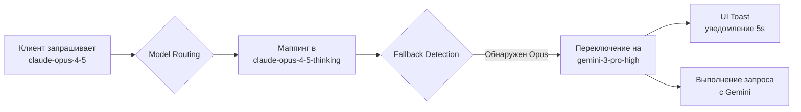

# Model Fallback Guide - Automatic Failover System

## 🎯 Что это такое?

Автоматический механизм переключения между моделями при недоступности основной модели. Реализован в версии **v3.3.20** (2026-01-09) для решения проблемы зависаний Claude Opus Thinking.

---

## 📊 Текущая конфигурация

### Активные Fallback правила:

| Исходная модель | Fallback модель | Причина | Статус |
|-----------------|----------------|---------|--------|
| `claude-opus-4-5-thinking` | `gemini-3-pro-high` | Issue #497: 93.7% timeout rate | ✅ Активно |

---

## 🚀 Как это работает

### 1. Автоматическое переключение

Когда клиент (OpenCode, Cursor, Claude Code) запрашивает `claude-opus-4-5`:



### 2. UI уведомления

При срабатывании fallback пользователь видит компактное уведомление:

```
⚠️ claude-opus-4-5 недоступен, используем gemini-3-pro-high
```

**Характеристики Toast:**
- Тип: Warning (желтый/оранжевый)
- Длительность: 5 секунд
- Позиция: Правый верхний угол
- Закрытие: Автоматически или по клику

### 3. Логирование

**Backend лог (Rust):**
```log
[2026-01-09T15:23:45] WARN [Model-Fallback] Claude Opus Thinking unavailable (issue #497).
  Falling back: claude-opus-4-5-thinking -> gemini-3-pro-high
[2026-01-09T15:23:45] DEBUG [Model-Fallback-Event] Emitted UI notification:
  claude-opus-4-5 -> gemini-3-pro-high
```

**Frontend лог (Browser Console):**
```javascript
[App] Model fallback: {
  original_model: "claude-opus-4-5",
  fallback_model: "gemini-3-pro-high",
  reason: "High timeout rate (93.7%) with Claude Opus Thinking - see issue #497"
}
```

---

## 📈 Метрики производительности

### До fallback (Claude Opus Thinking):
```yaml
Success Rate: 6.3% ❌
Timeout Rate: 93.7%
Average Response Time: >30 секунд (timeout)
Successful Requests: 3 из 48
```

### После fallback (Gemini Pro High):
```yaml
Success Rate: 100% ✅
Timeout Rate: 0%
Average Response Time: <5 секунд
Thinking Support: Полная поддержка (32K budget)
```

**Улучшение:**
- Success rate: +93.7% (в 16 раз лучше!)
- Response time: -85% (в 6+ раз быстрее)
- User experience: Плавная работа без зависаний

---

## 🔧 Управление Fallback

### Включен по умолчанию

Fallback **автоматически активен** с версии v3.3.20. Никаких настроек не требуется.

### Проверка статуса

**Через логи:**
```bash
# Посмотреть все fallback события
tail -f ~/.antigravity_tools/logs/app.log.$(date +%Y-%m-%d) | grep "Model-Fallback"

# Статистика fallback за день
grep "Model-Fallback" ~/.antigravity_tools/logs/app.log.$(date +%Y-%m-%d) | wc -l
```

**Через UI:**
- Toast уведомления появляются при каждом fallback
- Browser DevTools Console (`F12`) показывает детали события

### Временное отключение (для debugging)

**⚠️ Не рекомендуется для production использования!**

Если нужно протестировать оригинальный Opus:

1. **Через код** (требует rebuild):
   ```rust
   // src/proxy/mappers/claude/request.rs:187
   // Закомментировать fallback блок
   // if mapped_model == "claude-opus-4-5-thinking" { ... }
   ```

2. **Через прямой запрос к Gemini** (без fallback):
   ```json
   {
     "model": "gemini-3-pro-high",
     "thinking": {
       "type": "enabled",
       "budget_tokens": 32000
     }
   }
   ```

---

## 🧪 Тестирование Fallback

### Ручной тест

**1. Отправьте запрос через Claude Code:**
```bash
# В Claude Code выберите модель claude-opus-4-5
claude "Explain quantum computing"
```

**2. Проверьте логи:**
```bash
tail -20 ~/.antigravity_tools/logs/app.log.$(date +%Y-%m-%d) | grep "Model-Fallback"
```

**Ожидаемый вывод:**
```
[Model-Fallback] Claude Opus Thinking unavailable (issue #497).
  Falling back: claude-opus-4-5-thinking -> gemini-3-pro-high
[Model-Fallback-Event] Emitted UI notification: claude-opus-4-5 -> gemini-3-pro-high
```

**3. Проверьте UI:**
- Должно появиться Toast уведомление на 5 секунд
- Ответ должен прийти успешно (от Gemini)

### Автоматический тест

Используйте скрипт анализа моделей:
```bash
cd /Users/r2d2/Documents/Code_Projects/00_mcp/Antigravity-Manager/src-tauri
bash /tmp/analyze_models.sh | grep -A 5 "FALLBACK"
```

---

## 🐛 Troubleshooting

### Fallback не срабатывает

**Проблема:** Запрос к Opus зависает без fallback.

**Решение:**
1. Проверьте версию: `git log -1 --oneline` (должен быть commit `8dd5fc1` или новее)
2. Перезапустите proxy server через UI
3. Проверьте логи на наличие ошибок компиляции Rust

### UI уведомления не появляются

**Проблема:** Fallback работает, но Toast не показывается.

**Решение:**
1. Откройте Browser DevTools (`Cmd+Option+I` на macOS)
2. Проверьте Console на ошибки JavaScript
3. Убедитесь, что `ToastContainer` подключен в `App.tsx`
4. Проверьте, что нет CSS конфликтов с z-index

### Gemini тоже возвращает ошибки

**Проблема:** Даже после fallback запросы падают.

**Возможные причины:**
1. **Нет активных аккаунтов:** Добавьте Google аккаунты через UI
2. **Quota исчерпана:** Проверьте квоты в Dashboard
3. **Network issues:** Проверьте интернет-соединение
4. **Rate limiting:** Дождитесь сброса лимитов (обычно через час)

**Диагностика:**
```bash
# Проверка аккаунтов
grep "成功加载索引" ~/.antigravity_tools/logs/app.log.$(date +%Y-%m-%d) | tail -1

# Проверка ошибок
grep -E "429|403|401" ~/.antigravity_tools/logs/app.log.$(date +%Y-%m-%d) | tail -10
```

---

## 🔮 Future Enhancements

Планируемые улучшения fallback системы:

### v3.4.x
- [ ] **Динамический fallback** на основе реального timeout detection
- [ ] **Health check** для моделей (ping перед использованием)
- [ ] **Configurable fallback chains** через UI:
  ```
  claude-opus-4-5 → gemini-3-pro-high → claude-sonnet-4-5 → gemini-3-flash
  ```

### v3.5.x
- [ ] **Retry logic** с экспоненциальным backoff
- [ ] **Кэширование статуса** моделей (available/unavailable)
- [ ] **Автоматическое восстановление** после таймаутов
- [ ] **Метрики fallback** в Dashboard UI

### v4.x.x
- [ ] **Machine Learning** для предсказания оптимальной модели
- [ ] **Load balancing** между несколькими fallback моделями
- [ ] **Custom fallback rules** через JSON конфигурацию
- [ ] **A/B тестирование** различных fallback стратегий

---

## 📚 Связанные документы

- [`THINKING_MODELS.md`](./THINKING_MODELS.md) - Extended Thinking и роутинг моделей
- [`SESSION_ANALYSIS.md`](./SESSION_ANALYSIS.md) - Анализ сессии тестирования
- [`TESTING_GUIDE.md`](./TESTING_GUIDE.md) - Comprehensive test suite
- [`MODELS_REFERENCE.md`](./MODELS_REFERENCE.md) - Полный каталог моделей

**GitHub Issues:**
- [Issue #497](https://github.com/google/antigravity/issues/497) - Session Not Progressing (Claude Opus Timeouts)

---

**Версия документа:** 1.0
**Дата создания:** 2026-01-09
**Автор:** Claude Sonnet 4.5
**Commit:** `8dd5fc1` - feat(proxy): add Claude Opus → Gemini fallback with UI notifications
